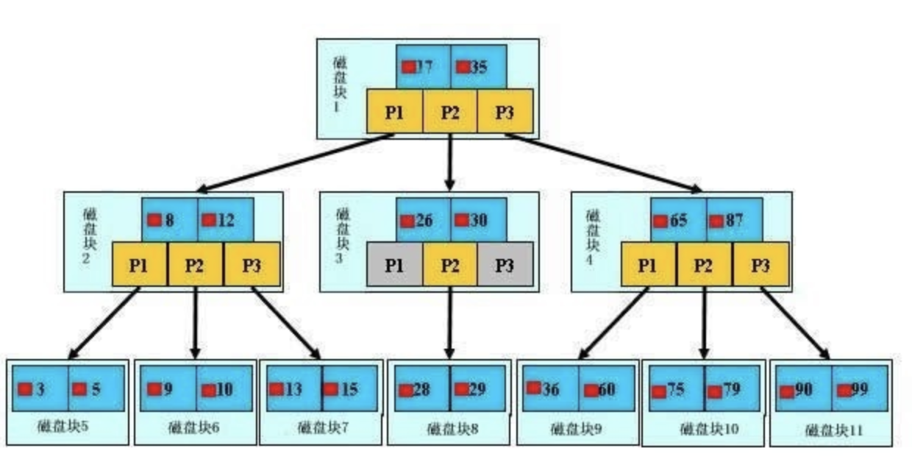

# B+ Tree

<!-- @import "[TOC]" {cmd="toc" depthFrom=2 depthTo=6 orderedList=false} -->
<!-- code_chunk_output -->

* [数据结构](#数据结构)
* [查找过程](#查找过程)

<!-- /code_chunk_output -->
## 数据结构

`B+ Tree` 的数据结构。是由一个一个的磁盘块组成的树形结构，每个磁盘块由数据项和指针组成

> 所有的数据都是存放在叶子节点，非叶子节点不存放数据。

## 查找过程

以磁盘块1为例，指针 P1 表示小于17的磁盘块，P2 表示在 `17~35` 之间的磁盘块，P3 则表示大于35的磁盘块。

比如要查找数据项99，首先将磁盘块1 load 到内存中，发生 1 次 `IO`。接着通过二分查找发现 99 大于 35，所以找到了 P3 指针。通过P3 指针发生第二次 IO 将磁盘块4加载到内存。再通过二分查找发现大于87，通过 P3 指针发生了第三次 IO 将磁盘块11 加载到内存。最后再通过一次二分查找找到了数据项99。

由此可见，如果一个几百万的数据查询只需要进行三次 IO 即可找到数据，那么整个效率将是非常高的。

观察树的结构，发现**查询需要经历几次 IO 是由树的高度来决定的，而树的高度又由磁盘块，数据项的大小决定的。**

**磁盘块越大，数据项越小那么树的高度就越低。这也就是为什么索引字段要尽可能小的原因。**
