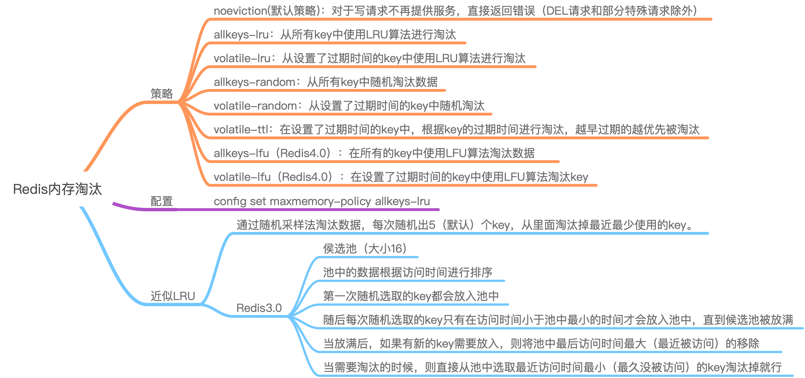

# Redis内存满了怎么办
<!-- @import "[TOC]" {cmd="toc" depthFrom=2 depthTo=6 orderedList=false} -->
<!-- code_chunk_output -->

* [思维导图](#思维导图)
* [1. Redis的内存淘汰策略](#1-redis的内存淘汰策略)
* [2. 如何获取及设置内存淘汰策略](#2-如何获取及设置内存淘汰策略)
* [3. Redis中的LRU是近似LRU](#3-redis中的lru是近似lru)
	* [3.1 缓存算法](#31-缓存算法)
	* [3.2 近似LRU](#32-近似lru)
	* [3.3 Redis3.0对近似LRU的优化](#33-redis30对近似lru的优化)
	* [3.4 Redis4.0 LFU算法](#34-redis40-lfu算法)
	* [3.5 为啥用近似LRU而不是严格LRU](#35-为啥用近似lru而不是严格lru)

<!-- /code_chunk_output -->
## 思维导图



## 1. Redis的内存淘汰策略

- noeviction(默认策略)：对于写请求不再提供服务，直接返回错误（DEL请求和部分特殊请求除外）
- allkeys-lru：从所有key中使用LRU算法进行淘汰
- volatile-lru：从设置了过期时间的key中使用LRU算法进行淘汰
- allkeys-random：从所有key中随机淘汰数据
- volatile-random：从设置了过期时间的key中随机淘汰
- volatile-ttl：在设置了过期时间的key中，根据key的过期时间进行淘汰，越早过期的越优先被淘汰
- volatile-lfu（Redis4.0）：在设置了过期时间的key中使用LFU算法淘汰key
- allkeys-lfu（Redis4.0）：在所有的key中使用LFU算法淘汰数据

当使用volatile-lru、volatile-random、volatile-ttl这三种策略时，如果没有key可以被淘汰，则和noeviction一样返回错误。

## 2. 如何获取及设置内存淘汰策略

```sh
# 获取当前内存淘汰策略
$ config get maxmemory-policy
# 通过配置文件设置淘汰策略（修改redis.conf文件）
maxmemory-policy allkeys-lru
# 通过命令修改淘汰策略：
config set maxmemory-policy allkeys-lru
```

## 3. Redis中的LRU是近似LRU

### 3.1 缓存算法

参考 [缓存算法LRU、LFU、FIFO](https://gknoone.github.io/java-interview/#/算法/缓存算法LRU、LFU、FIFO)

### 3.2 近似LRU

**近似LRU算法通过随机采样法淘汰数据，每次随机出5（默认）个key，从里面淘汰掉最近最少使用的key。**

可以通过maxmemory-samples参数修改采样数量：

例：`maxmemory-samples 10`

maxmenory-samples配置的越大，淘汰的结果越接近于严格的LRU算法

Redis为了实现近似LRU算法，给每个key增加了一个额外增加了一个24bit的字段，用来存储该key最后一次被访问的时间。

### 3.3 Redis3.0对近似LRU的优化

Redis3.0对近似LRU算法进行了一些优化。新算法会维护一个候选池（大小为16），**池中的数据根据访问时间进行排序**，第一次随机选取的key都会放入池中，随后每次随机选取的key**只有在访问时间小于池中最小的时间才会放入池中，直到候选池被放满。当放满后，如果有新的key需要放入，则将池中最后访问时间最大（最近被访问）的移除**。

当需要淘汰的时候，则**直接从池中选取最近访问时间最小（最久没被访问）的key淘汰掉**就行。

### 3.4 Redis4.0 LFU算法

可以体现key的热度

### 3.5 为啥用近似LRU而不是严格LRU

Redis不使用一个真正的LRU算法实现的原因是**它需要消耗更多内存**。然而，对于使用Redis的应用来说近似LRU算法和真正的LRU算法几乎是等价的。
