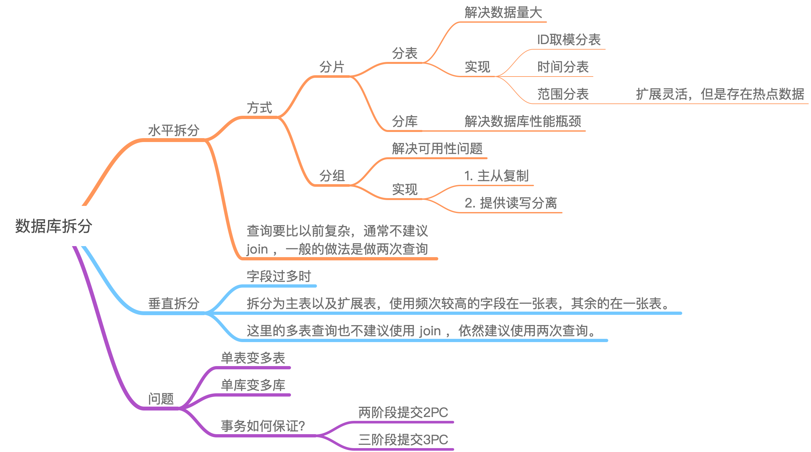

# 数据库水平垂直拆分
<!-- @import "[TOC]" {cmd="toc" depthFrom=2 depthTo=6 orderedList=false} -->
<!-- code_chunk_output -->

* [思维导图](#思维导图)
* [水平拆分](#水平拆分)
* [垂直拆分](#垂直拆分)
* [两阶段提交2pc(Two Phase Commit)](#两阶段提交2pctwo-phase-commit)
* [最终一致性](#最终一致性)

<!-- /code_chunk_output -->
## 思维导图

## 水平拆分
一般水平拆分是根据表中的某一字段(通常是主键 ID )取模处理，将一张表的数据拆分到多个表中。这样每张表的表结构是相同的但是数据不同。

不但可以通过 ID 取模分表还可以通过时间分表，比如每月生成一张表。 按照范围分表也是可行的:一张表只存储 0~1000W的数据，超过只就进行分表，这样分表的优点是扩展灵活，但是存在热点数据。

按照取模分表拆分之后我们的查询、修改、删除也都是取模。比如新增一条数据的时候往往需要一张临时表来生成 ID,然后根据生成的 ID 取模计算出需要写入的是哪张表(也可以使用分布式 ID 生成器来生成 ID)。

分表之后不能避免的就是查询要比以前复杂，通常不建议 join ，一般的做法是做两次查询。
## 垂直拆分
当一张表的字段过多时则可以考虑垂直拆分。 通常是将一张表的字段才分为主表以及扩展表，使用频次较高的字段在一张表，其余的在一张表。

这里的多表查询也不建议使用 join ，依然建议使用两次查询。

拆分之后带来的问题
拆分之后由一张表变为了多张表，一个库变为了多个库。最突出的一个问题就是事务如何保证。

## 两阶段提交2pc(Two Phase Commit)

**二阶段提交的算法思路可以概括为：** **参与者将操作成败通知协调者，再由协调者根据所有参与者的反馈情报决定各参与者是否要提交操作还是中止操作。**

两阶段提交协议(Two Phase Commitment Protocol)中，涉及到两种角色

一个事务协调者（coordinator）：负责协调多个参与者进行事务投票及提交(回滚)
多个事务参与者（participants）：即本地事务执行者

总共处理步骤有两个
（1）投票阶段（voting phase）：事务**协调者**给每个**参与者**发送**Prepare消息**，每个参与者**要么直接返回失败**(如权限验证失败)，**要么在本地执行事务，写本地的redo和undo日志，但不提交**，到达一种“万事俱备，只欠东风”的状态。；

（2）提交阶段（commit phase）：如果协调者收到了参与者的失败消息或者超时，直接给每个参与者发送回滚(Rollback)消息；否则，发送提交(Commit)消息；参与者根据协调者的指令执行提交或者回滚操作，释放所有事务处理过程中使用的锁资源。(注意:必须在最后阶段释放锁资源)

如果任一资源管理器在第一阶段返回准备失败，那么事务管理器会要求所有资源管理器在第二阶段执行回滚操作。通过事务管理器的两阶段协调，最终所有资源管理器要么全部提交，要么全部回滚，最终状态都是一致的

## 最终一致性

如果业务对强一致性要求不是那么高那么最终一致性则是一种比较好的方案。

通常的做法就是补偿，比如 一个业务是 A 调用 B，两个执行成功才算最终成功，当 A 成功之后，B 执行失败如何来通知 A 呢。

比较常见的做法是 失败时 B 通过 MQ 将消息告诉 A，A 再来进行回滚。这种的前提是 A 的回滚操作得是幂等的，不然 B 重复发消息就会出现问题。
