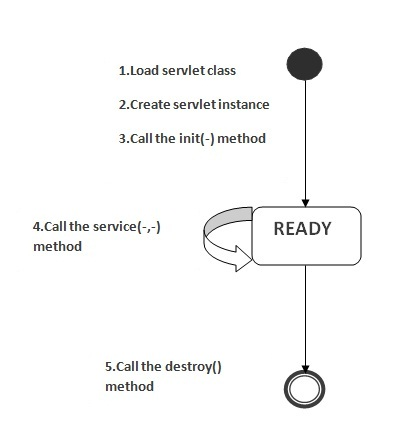

# Servlet生命周期
返回[README.md](./../../README.md)

---
目录

<!-- @import "[TOC]" {cmd="toc" depthFrom=2 depthTo=6 orderedList=false} -->
<!-- code_chunk_output -->

* [过程](#过程)
* [周期](#周期)
* [引用](#引用)
* [返回目录](#返回目录)

<!-- /code_chunk_output -->

---
## 过程
Servlet 生命周期可被定义为从创建直到毁灭的整个过程。以下是 Servlet 遵循的过程：

1. Servlet 通过调用 init () 方法进行初始化。
2. Servlet 调用 service() 方法来处理客户端的请求。
3. Servlet 通过调用 destroy() 方法终止（结束）。
4. 最后，Servlet 是由 JVM 的垃圾回收器进行垃圾回收的。


## 周期
1. 加载Servlet类
类加载器负责加载servlet类。 当Web容器接收到servlet的第一个请求时，将加载servlet类。
2. 创建Servlet实例
Web容器在加载servlet类之后创建一个servlet的实例。servlet实例在servlet生命周期中只创建一次。
3. 调用init方法
- init 方法被设计成**只调用一次**。它在第一次创建 Servlet 时被调用，在后续每次用户请求时不再调用。
- Servlet 创建于用户第一次调用对应于该 Servlet 的 URL 时，但是您也可以指定 Servlet 在服务器第一次启动时被加载。
当用户调用一个 Servlet 时，就会创建一个 Servlet 实例，每一个用户请求都会产生一个新的线程，适当的时候移交给 doGet 或 doPost 方法。**init() 方法简单地创建或加载一些数据，这些数据将被用于 Servlet 的整个生命周期。**
init方法的语法如下：
```java
public void init(ServletConfig config) throws ServletException
```
4. 调用service方法
- 每当接收到servlet的请求时，Web容器都会调用service方法。如果servlet未初始化，则遵循上述前三个步骤，然后调用service方法。 如果servlet被初始化，它调用service方法。 请注意，servlet仅初始化一次。
- service() 方法是执行实际任务的主要方法。Servlet 容器（即 Web 服务器）调用 service() 方法来处理来自客户端（浏览器）的请求，并把格式化的响应写回给客户端。
- 每次服务器接收到一个 Servlet 请求时，服务器会产生一个新的线程并调用服务。service() 方法检查 HTTP 请求类型（GET、POST、PUT、DELETE 等），并在适当的时候调用 doGet、doPost、doPut，doDelete 等方法。
Servlet接口的service方法的语法如下：
```java
public void service(ServletRequest request, ServletResponse response)
  throws ServletException, IOException
```
> service() 方法由容器调用，service 方法在适当的时候调用 doGet、doPost、doPut、doDelete 等方法。所以，您不用对 service() 方法做任何动作，您只需要根据来自客户端的请求类型来重写 doGet() 或 doPost() 即可。
>
5. 调用destroy方法
从服务中删除servlet实例之前，Web容器调用destroy方法。它使servlet有机会清理所有资源，例如 关闭数据库连接、停止后台线程、把 Cookie 列表或点击计数器写入到磁盘，并执行其他类似的清理活动等。Servlet接口的destroy方法的语法如下：
```java
public void destroy()
```


---
## 引用
[]()

---
## 返回目录
[README.md](./../../README.md)
