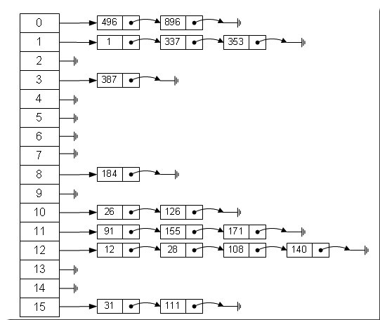

# java中==和equals和hashCode的区别

返回[README.md](./../../README.md)

---
目录
<!-- @import "[TOC]" {cmd="toc" depthFrom=2 depthTo=6 orderedList=false} -->
<!-- code_chunk_output -->

* [太长不看](#太长不看)
* [==](#)
* [equals](#equals)
* [hashCode](#hashcode)
	* [原理](#原理)
	* [添加原则](#添加原则)
	* [应用原则](#应用原则)
* [引用](#引用)
* [返回目录](#返回目录)

<!-- /code_chunk_output -->

---

## 太长不看
- hashcode是系统用来快速检索对象而使用
- equals方法本意是用来判断引用的对象是否一致
- 重写equals方法和hashcode方法时，equals方法中用到的成员变量也必定会在hashcode方法中用到,只不过前者作为比较项，后者作为生成摘要的信息项，本质上所用到的数据是一样的，从而保证二者的一致性

## ==

- 在用关系操作符 == 比较的是值本身
- 对象类型的比较，比较的是地址（引用），而非值本身，也是就是说他们实际存储的内存地址不同。


```java
int n=3;
int m=3;

System.out.println(n==m);

String str = new String("hello");
String str1 = new String("hello");
String str2 = new String("hello");

System.out.println(str1==str2);

str1 = str;
str2 = str;
System.out.println(str1==str2);
```
> 结果是：true，false，true

## equals
> 比较两个对象的引用是否相等，即 是否指向同一个对象。


总结

- 对于`==`，如果作用于基本数据类型，则直接比较其存储的“值”是否相等，如果作用于引用类型的变量，则比较的是所指向的对象的地址。
- 对于`equals`方法，注意：**equals不能作用于基本数据类型**，如果没有对equals进行重写，则比较的是引用类所指向的地址。如果重写了，比较的就是对象的内容。


```java
//String 重写了equals方法
public boolean equals(Object anObject) {
    if (this == anObject) {//判断类型是否一致
        return true;
    }
    if (anObject instanceof String) {
        String anotherString = (String) anObject;
        int n = count;
        if (n == anotherString.count) {//判断内容长度是否一致
            int i = 0;
            while (n-- != 0) {//判断内容是否一致
                if (charAt(i) != anotherString.charAt(i))
                        return false;
                i++;
            }
            return true;
        }
    }
    return false;
}
```

## hashCode

### 原理


> Hash 就是把任意长度的输入(又叫做预映射， pre-image)，通过散列算法，变换成固定长度的输出(int)，该输出就是散列值。这种转换是一种压缩映射，也就是说，**散列值的空间通常远小于输入的空间。不同的输入可能会散列成相同的输出，从而不可能从散列值来唯一的确定输入值。** 简单的说，就是一种 **将任意长度的消息压缩到某一固定长度的消息摘要** 的函数。


用来鉴定两个对象是否相等，Object类中的`hashCode`方法返回**对象在内存中地址转换成的一个int值**，所以如果没有重写hashCode方法，任何对象的hashCode方法是不相等的。

设计`hashCode()`时最重要的因素就是：无论何时，对**同一个对象**调用`hashCode`都应该**产生同一个值**。

### 添加原则

实际应用的hash表的添加原则：
- 先调用这个元素的 hashCode 方法，然后根据所得到的值计算出元素应该在数组的位置。如果这个位置上没有元素，那么直接将它存储在这个位置上；
- 如果这个位置上已经有元素了，那么调用它的equals方法与新元素进行比较：相同的话就不存了，否则，将其存在这个位置对应的链表中（Java 中 HashSet, HashMap 和 Hashtable的实现总将元素放到链表的表头）。


> 也即，定义一个数组，数组内元素为链表，相同的hash值元素存放在同一个链表中，这样，插入和查询都会相对很快。




如果重写了`equals`方法就必须要重写`hashCode`方法，以便用户将对象插入到散列表中。

### 应用原则

原则 1 ： 如果 x.equals(y) 返回 “true”，那么 x 和 y 的 hashCode() 必须相等 ；
原则 2 ： 如果 x.equals(y) 返回 “false”，那么 x 和 y 的 hashCode() 有可能相等，也有可能不等 ；
原则 3 ： 如果 x 和 y 的 hashCode() 不相等，那么 x.equals(y) 一定返回 “false” ；
原则 4 ： 一般来讲，equals 这个方法是给用户调用的，而 hashcode 方法一般用户不会去调用 ；
原则 5 ： 当一个对象类型作为集合对象的元素时，那么这个对象应该拥有自己的equals()和hashCode()设计，而且要遵守前面所说的几个原则。

在每个覆盖了 equals 方法的类中，也必须覆盖 hashCode 方法，如果不这样做的话，就会违反 Object.hashCode 的通用约定。从而导致该类无法结合所有基于散列的集合一起正常运作。

----

## 引用

[Java 中的 ==, equals 与 hashCode 的区别与联系](https://blog.csdn.net/justloveyou_/article/details/52464440)

---

## 返回目录

[README.md](./../../README.md)
