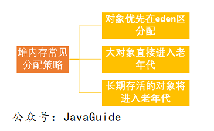

## JVM内存分配机制和回收

堆空间的基本结构

- 新生代
  - eden 区
  - s0("From") 区
  - s1("To") 区
- 老年代
  - tentired 区

对象都会首先在 Eden 区域分配，在一次新生代垃圾回收后，如果对象还存活，则会进入 s1("To")，并且对象的年龄还会加 1(Eden 区->Survivor 区后对象的初始年龄变为 1)，当它的年龄增加到一定程度（默认为 15 岁），就会被晋升到老年代中。对象晋升到老年代的年龄阈值，可以通过参数 -XX:MaxTenuringThreshold 来设置。经过这次GC后，Eden区和"From"区已经被清空。这个时候，"From"和"To"会交换他们的角色，也就是新的"To"就是上次GC前的“From”，新的"From"就是上次GC前的"To"。不管怎样，都会保证名为To的Survivor区域是空的。Minor GC会一直重复这样的过程，直到“To”区被填满，"To"区被填满之后，会将所有对象移动到年老代中。

### 对象优先在eden区分配
对象在新生代中 eden 区分配。当 eden 区没有足够空间进行分配时，虚拟机将发起一次 **Minor GC**.下面我们来进行实际测试以下。

#### Minor GC 和 Full GC的区别
- 新生代 GC（Minor GC）:指发生新生代的的垃圾收集动作，Minor GC 非常频繁，回收速度一般也比较快。
- 老年代 GC（Major GC/Full GC）:指发生在老年代的 GC，出现了 Major GC 经常会伴随至少一次的 Minor GC（并非绝对），Major GC 的速度一般会比 Minor GC 的慢 10 倍以上。
