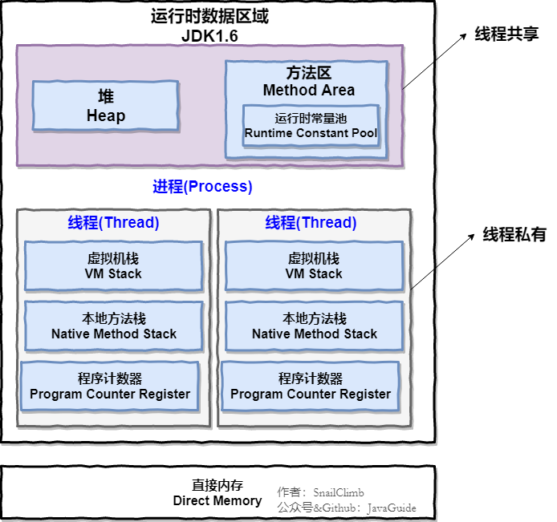
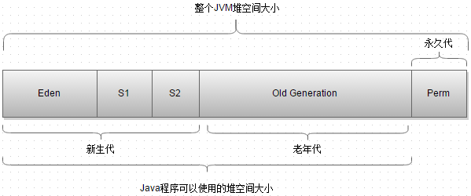
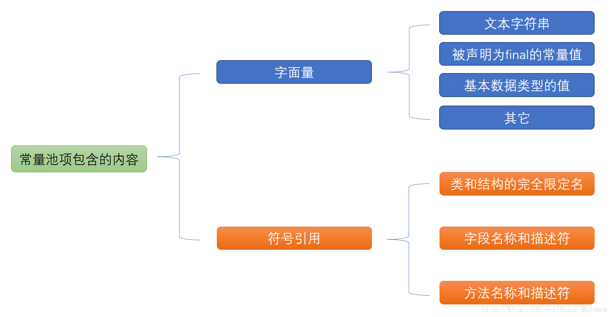
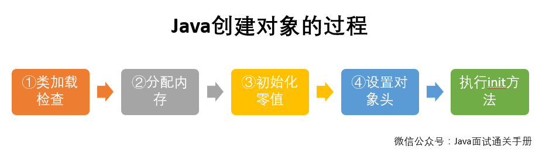
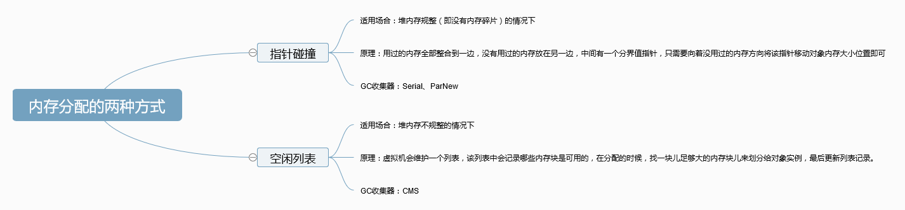
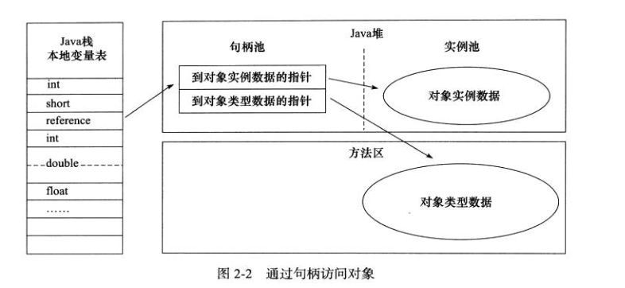
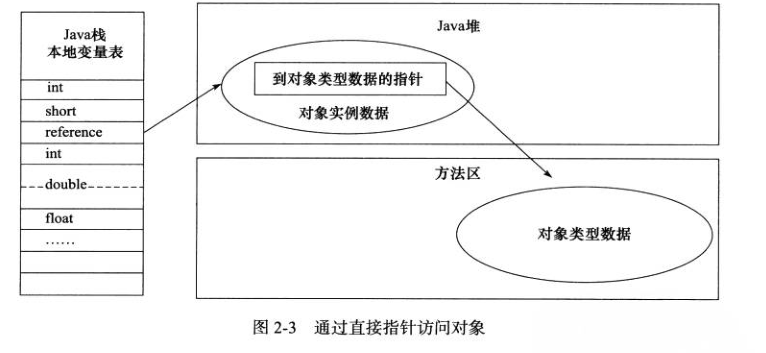

# Java内存
<!-- @import "[TOC]" {cmd="toc" depthFrom=1 depthTo=6 orderedList=false} -->
<!-- code_chunk_output -->

* [Java内存](#java内存)
	* [Q1: Java 内存区域（运行时数据区）](#q1-java-内存区域运行时数据区)
		* [程序计数器](#程序计数器)
		* [Java 虚拟机栈](#java-虚拟机栈)
		* [本地方法栈](#本地方法栈)
		* [堆](#堆)
		* [方法区](#方法区)
		* [运行时常量池](#运行时常量池)
		* [直接内存](#直接内存)
	* [Q2: java对象创建过程](#q2-java对象创建过程)
	* [Q3:对象的内存布局](#q3对象的内存布局)
	* [Q4:对象的访问定位](#q4对象的访问定位)
		* [句柄](#句柄)
		* [直接指针](#直接指针)
	* [Q5: String 类和常量池](#q5-string-类和常量池)
		* [创建](#创建)
		* [拼接](#拼接)
	* [Q6:String s1 = new String("abc");这句话创建了几个对象？](#q6string-s1-new-stringabc这句话创建了几个对象)
	* [8种基本类型的包装类和常量池](#8种基本类型的包装类和常量池)

<!-- /code_chunk_output -->


## Q1: Java 内存区域（运行时数据区）
1. 线程私有
    - 虚拟机栈
    - 本地方法栈
    - 程序计数器
2. 线程共有
    - 堆
    - 方法区（含本地常量池）
    - 直接内存



### 程序计数器
> 程序计数器是唯一一个不会出现OutOfMemoryError的内存区域，它的生命周期随着线程的创建而创建，随着线程的结束而死亡。

程序计数器是一块较小的内存空间，可以看作是当前线程所执行的字节码的行号指示器。**字节码解释器工作时通过改变这个计数器的值来选取下一条需要执行的字节码指令，分支、循环、跳转、异常处理、线程恢复等功能都需要依赖这个计数器来完。**

另外，**为了线程切换后能恢复到正确的执行位置，每条线程都需要有一个独立的程序计数器，各线程之间计数器互不影响，独立存储，我们称这类内存区域为“线程私有”的内存。**

总结，作用如下：
- 字节码解释器通过改变程序计数器来依次读取指令，从而**实现代码的流程控制**，如：顺序执行、选择、循环、异常处理。
- 在多线程的情况下，程序计数器用于记录当前线程执行的位置，从而当线程被切换回来的时候能够**知道该线程上次运行到哪儿了**。

### Java 虚拟机栈
> 描述的是 Java 方法执行的内存模型。

Java 内存可以粗糙的区分为堆内存（Heap）和栈内存(Stack),其中栈就是现在说的虚拟机栈，或者说是**虚拟机栈中局部变量表**部分。（实际上，Java虚拟机栈是由一个个栈帧组成，而每个栈帧中都拥有：局部变量表、操作数栈、动态链接、方法出口信息。）

**局部变量表主要存放了编译器可知的各种数据类型**（boolean、byte、char、short、int、float、long、double）、对象引用（reference类型，它不同于对象本身，可能是一个指向对象起始地址的引用指针，也可能是指向一个代表对象的句柄或其他与此对象相关的位置）。

Java 虚拟机栈会出现两种异常：
- **StackOverFlowError**
    - 若Java虚拟机栈的内存大小不允许动态扩展，那么当线程请求栈的深度超过当前Java虚拟机栈的最大深度的时候，就抛出StackOverFlowError异常。
- **OutOfMemoryError**
    - 若 Java 虚拟机栈的内存大小允许动态扩展，且当线程请求栈时内存用完了，无法再动态扩展了，此时抛出OutOfMemoryError异常。

### 本地方法栈
虚拟机栈为虚拟机执行 Java 方法 （也就是字节码）服务
而本地方法栈则为虚拟机使用到的**Native 方法服务**

### 堆
> 最大一块区域
> Java 堆是垃圾收集器管理的主要区域，因此也被称作GC堆（Garbage Collected Heap）


此内存区域的唯一目的就是存放对象实例，几乎所有的对象实例以及数组都在这里分配内存。

分代垃圾收集算法

分代：新生代和老年代，
再细致一点有：Eden空间、From Survivor、To Survivor空间等。
进一步划分的目的是**更好地回收内存，或者更快地分配内存。**

**在 JDK 1.8中移除整个永久代，取而代之的是一个叫元空间（Metaspace）的区域（永久代使用的是JVM的堆内存空间，而元空间使用的是物理内存，直接受到本机的物理内存限制）**

### 方法区
方法区与 Java 堆一样，是各个线程共享的内存区域，它用于**存储已被虚拟机加载的类信息、常量、静态变量、即时编译器编译后的代码等数据**。虽然Java虚拟机规范把方法区描述为堆的一个逻辑部分，但是它却有一个别名叫做 Non-Heap（非堆），目的应该是与 Java 堆区分开来。

### 运行时常量池


### 直接内存
直接内存并不是虚拟机运行时数据区的一部分，也不是虚拟机规范中定义的内存区域，但是这部分内存也被频繁地使用。而且也可能导致 OutOfMemoryError 异常出现。

JDK1.4中新加入的 NIO(New Input/Output) 类，引入了一种基于通道（Channel） 与缓存区（Buffer） 的 I/O 方式，它可以直接使用Native函数库直接分配堆外内存，然后通过一个存储在 Java 堆中的 DirectByteBuffer 对象作为这块内存的引用进行操作。这样就能在一些场景中显著提高性能，因为避免了在 Java 堆和 Native 堆之间来回复制数据。

本机直接内存的分配不会收到 Java 堆的限制，但是，既然是内存就会受到本机总内存大小以及处理器寻址空间的限制

## Q2: java对象创建过程


1. 类加载检查
    - 虚拟机遇到一条 new 指令时，首先将去检查这个指令的参数是否能**在常量池中定位到这个类的符号引用**，并且检查这个符号引用代表的类**是否已被加载过、解析和初始化过**。如果没有，那必须先执行相应的类加载过程。
2. 分配内存
    - 在**类加载检查**通过后，接下来虚拟机将为新生对象**分配内存**。对象所需的内存大小在类加载完成后便可确定，为对象分配空间的任务等同于把一块确定大小的内存从 Java 堆中划分出来。
    - 分配方式有 “**指针碰撞**”和 “**空闲列表**” 两种，选择那种分配方式由 Java 堆**是否规整决定**，而Java堆是否规整又由所采用的垃圾收集器**是否带有压缩整理功能决定**。
    - Java 堆内存是否规整，取决于 GC 收集器的算法是
      - "标记-清除"，
      - "标记-整理"（也称作"标记-压缩"）
      - 值得注意的是，复制算法内存也是规整的
    
    - 内存分配并发问题,虚拟机采用两种方式来保证线程安全:
      - CAS+失败重试
        - CAS 是乐观锁的一种实现方式。所谓乐观锁就是，每次不加锁而是假设没有冲突而去完成某项操作，如果因为冲突失败就重试，直到成功为止。**虚拟机采用 CAS 配上失败重试的方式保证更新操作的原子性。**
      - TLAB
        - 为每一个线程预先在Eden区分配一块儿内存，JVM在给线程中的对象分配内存时，首先在TLAB分配，当对象大于TLAB中的剩余内存或TLAB的内存已用尽时，再采用上述的CAS进行内存分配
3. 初始化零值
    - 内存分配完成后，虚拟机需要**将分配到的内存空间都初始化为零值**（不包括对象头），这一步操作 **保证了对象的实例字段在 Java 代码中可以不赋初始值就直接使用**，程序能访问到这些字段的数据类型所对应的零值。
4. 设置对象头
    - 初始化零值完成之后，虚拟机要对**对象进行必要的设置**，例如这个对象是哪个类的实例、如何才能找到类的元数据信息、对象的哈希吗、对象的 GC 分代年龄等信息。 这些信息存放在对象头中。 另外，根据虚拟机当前运行状态的不同，如是否启用偏向锁等，对象头会有不同的设置方式。
5. 执行 init 方法
    - 在上面工作都完成之后，从虚拟机的视角来看，一个新的对象已经产生了，但从 Java 程序的视角来看，对象创建才刚开始，·、`<init>` 方法还没有执行，所有的字段都还为零。所以一般来说，执行 new 指令之后会接着执行 `<init>` 方法，把对象按照程序员的意愿进行初始化，这样一个真正可用的对象才算完全产生出来。

## Q3:对象的内存布局
对象在内存中的布局可以分为3块区域
- 对象头
  - 第一部分用于**存储对象自身的自身运行时数据**（哈希码、GC分代年龄、锁状态标志等等）
  - 另一部分是**类型指针**，即对象指向它的类元数据的指针，虚拟机通过这个指针来确定这个对象是那个类的实例。
- 实例数据
  - 对象真正存储的有效信息
- 对齐填充
  - 不是必然存在的，也没有什么特别的含义，仅仅起占位作用
  - 对象的大小必须是8字节的整数倍

## Q4:对象的访问定位
建立对象就是为了使用对象，我们的Java程序通过栈上的 reference 数据来操作堆上的具体对象。对象的访问方式有虚拟机实现而定，目前主流的访问方式有①使用句柄和②直接指针两种

- 使用句柄来访问的最大好处是 **reference 中存储的是稳定的句柄地址，在对象被移动时只会改变句柄中的实例数据指针，而 reference 本身不需要修改**。
- 使用直接指针访问方式最大的好处就是**速度快**，它节省了一次指针定位的时间开销。
### 句柄
如果使用句柄的话，那么Java**堆中将会划分出一块内存来作为句柄池**，**reference 中存储的就是对象的句柄地址**。
句柄中包含了
- **对象实例数据**具体地址信息
- **对象类型数据**具体地址信息；

### 直接指针
如果使用直接指针访问，那么 Java 堆对象的布局中就必须考虑如何放置访问类型数据的相关信息，而**reference 中存储的直接就是对象的地址**。


## Q5: String 类和常量池
### 创建
```java
//在常量池中拿对象
String str1 = "abcd";
//直接在堆内存空间创建一个新的对象
String str2 = new String("abcd");
System.out.println(str1==str2);//false
```

- 直接使用双引号声明出来的 String 对象会直接存储在常量池中。
- 如果不是用双引号声明的 String 对象，可以使用 String 提供的 intern 方法。String.intern() 是一个 Native 方法，它的作用是：**如果运行时常量池中已经包含一个等于此 String 对象内容的字符串，则返回常量池中该字符串的引用；如果没有，则在常量池中创建与此 String 内容相同的字符串，并返回常量池中创建的字符串的引用。**

```java
String s1 = new String("计算机");
String s2 = s1.intern();
String s3 = "计算机";
System.out.println(s2);//计算机
System.out.println(s1 == s2);//false，因为一个是堆内存中的String对象一个是常量池中的String对象，
System.out.println(s3 == s2);//true，因为两个都是常量池中的String对象
```
### 拼接

```java
String str1 = "str";
String str2 = "ing";

String str3 = "str" + "ing";//常量池中的对象
String str4 = str1 + str2; //在堆上创建的新的对象
String str5 = "string";//常量池中的对象
System.out.println(str3 == str4);//false
System.out.println(str3 == str5);//true
System.out.println(str4 == str5);//false
```

## Q6:String s1 = new String("abc");这句话创建了几个对象？
2个；
先有字符串"abc"放入常量池，然后 new 了一份字符串"abc"放入Java堆(字符串常量"abc"在编译期就已经确定放入常量池，而 Java 堆上的"abc"是在运行期初始化阶段才确定)，然后 Java 栈的 str1 指向Java堆上的"abc"。

## 8种基本类型的包装类和常量池

- Java 基本类型的包装类的大部分都实现了常量池技术，即Byte,Short,Integer,Long,Character,Boolean；这5种包装类默认创建了数值[-128，127]的相应类型的缓存数据，但是**超出此范围仍然会去创建新的对象**。

- 两种浮点数类型的包装类 Float,Double 并没有实现常量池技术。

```java
Integer i1 = 33;
Integer i2 = 33;
System.out.println(i1 == i2);// 输出true
Integer i11 = 333;
Integer i22 = 333;
System.out.println(i11 == i22);// 输出false
Double i3 = 1.2;
Double i4 = 1.2;
System.out.println(i3 == i4);// 输出false
```
