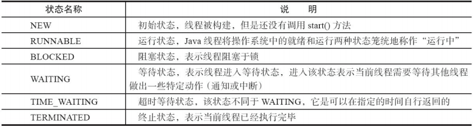

<!-- @import "[TOC]" {cmd="toc" depthFrom=1 depthTo=6 orderedList=false} -->
<!-- code_chunk_output -->

* [线程和进程](#线程和进程)
* [为什么程序计数器是线程私有](#为什么程序计数器是线程私有)
* [虚拟机栈和本地方法栈为什么是私有的?](#虚拟机栈和本地方法栈为什么是私有的)
* [一句话简单了解堆和方法区](#一句话简单了解堆和方法区)
* [说说并发与并行的区别?](#说说并发与并行的区别)
* [多线程问题](#多线程问题)
* [说说线程的生命周期和状态?](#说说线程的生命周期和状态)
* [什么是上下文切换](#什么是上下文切换)
* [什么是线程死锁?🦍💖](#什么是线程死锁)
* [如何避免死锁?🦍💖](#如何避免死锁)
* [说说 sleep() 方法和 wait() 方法区别和共同点?](#说说-sleep-方法和-wait-方法区别和共同点)
* [为什么我们调用 start() 方法时会执行 run() 方法，为什么我们不能直接调用 run() 方法？](#为什么我们调用-start-方法时会执行-run-方法为什么我们不能直接调用-run-方法)

<!-- /code_chunk_output -->

## 线程和进程
线程私有：
- 虚拟机栈（VM Stack）
- 本地方法栈（Native Method Stack)
- 程序计数器（Program Counter Register)

线程共有
- 堆（Heap）
- 方法区（Method Area）
  - 运行时常量池（Runtime Constant Pool)
- 直接内存（Direct Memory）

## 为什么程序计数器是线程私有
1. 控制线程的扭转，**字节码解释器通过改变程序计数器来依次读取指令，从而实现代码的流程控制**
2. 多线程操作时，记录线程执行到的位置，从而当线程被切换回来的时候能够**知道该线程上次运行到哪儿了**。

## 虚拟机栈和本地方法栈为什么是私有的?

- **虚拟机栈**：每个 Java 方法在执行的同时会创建一个**栈帧**用于存储**局部变量表**、**操作数栈**、**常量池引用** 等信息。从方法调用直至执行完成的过程，就对应着一个栈帧在 Java 虚拟机栈中入栈和出栈的过程。

- **本地方法栈**：和虚拟机栈所发挥的作用非常相似，区别是： **虚拟机栈为虚拟机执行 Java 方法 （也就是字节码）服务，而本地方法栈则为虚拟机使用到的 Native 方法服务**。

## 一句话简单了解堆和方法区
- 堆是进程中最大的一块内存，主要用于存放**新创建的对象**
- 方法区主要用于存放**已被加载的类信息**、**常量**、**静态变量**、**即时编译器编译后的代码** 等数据

## 说说并发与并行的区别?
- 并发： 同一时间段，多个任务都在执行 (单位时间内不一定同时执行)；
- 并行： 单位时间内，多个任务同时执行。

## 多线程问题
- 内存泄漏
- 上下文切换
- 死锁
- 受限于硬件和软件的资源闲置问题

## 说说线程的生命周期和状态?
Java 线程在运行的生命周期中的指定时刻只可能处于下面 6 种不同状态的其中一个状态


- new：初始状态
- Runnable：运行状态（运行+就绪）
- Blocked：阻塞状态
- waiting：等待状态
- time_waiting：超时等待状态
- terminated：终止状态


## 什么是上下文切换

多线程编程中一般线程的个数都大于 CPU 核心的个数，而一个 CPU 核心在任意时刻只能被一个线程使用，为了让这些线程都能得到有效执行，CPU 采取的策略是**为每个线程分配时间片并轮转的形式**。**当一个线程的时间片用完的时候就会重新处于就绪状态让给其他线程使用，这个过程就属于一次上下文切换**。

概括来说就是：**当前任务在执行完 CPU 时间片切换到另一个任务之前会先保存自己的状态，以便下次再切换会这个任务时，可以再加载这个任务的状态。任务从保存到再加载的过程就是一次上下文切换。**

上下文切换通常是计算密集型的。也就是说，它需要相当可观的处理器时间，在每秒几十上百次的切换中，每次切换都需要纳秒量级的时间。所以，上下文切换对系统来说意味着消耗大量的 CPU 时间，事实上，可能是操作系统中时间消耗最大的操作。

## 什么是线程死锁?🦍💖
多个线程同时被阻塞，它们中的一个或者全部都在等待某个资源被释放。由于线程被无限期地阻塞，因此程序不可能正常终止。

产生死锁必须具备以下四个条件：
1. **互斥条件**：该资源任意一个时刻只由一个线程占用。
2. **请求与保持条件**：一个进程因请求资源而阻塞时，对已获得的资源保持不放。
3. **不剥夺条件**:线程已获得的资源在末使用完之前不能被其他线程强行剥夺，只有自己使用完毕后才释放资源。
4. **循环等待条件**:若干进程之间形成一种头尾相接的循环等待资源关系。
```java
public class DeadLockDemo {
    private static Object resource1 = new Object();//资源 1
    private static Object resource2 = new Object();//资源 2

    public static void main(String[] args) {
        new Thread(() -> {
            synchronized (resource1) {
                System.out.println(Thread.currentThread() + "get resource1");
                try {
                    Thread.sleep(1000);
                } catch (InterruptedException e) {
                    e.printStackTrace();
                }
                System.out.println(Thread.currentThread() + "waiting get resource2");
                synchronized (resource2) {
                    System.out.println(Thread.currentThread() + "get resource2");
                }
            }
        }, "线程 1").start();

        new Thread(() -> {
            synchronized (resource2) {
                System.out.println(Thread.currentThread() + "get resource2");
                try {
                    Thread.sleep(1000);
                } catch (InterruptedException e) {
                    e.printStackTrace();
                }
                System.out.println(Thread.currentThread() + "waiting get resource1");
                synchronized (resource1) {
                    System.out.println(Thread.currentThread() + "get resource1");
                }
            }
        }, "线程 2").start();
    }
}
```

## 如何避免死锁?🦍💖
我们只要破坏产生死锁的四个条件中的其中一个就可以了。

- 破坏互斥条件
  - 这个条件我们没有办法破坏，因为我们用锁本来就是想让他们互斥的（临界资源需要互斥访问）。

- 破坏请求与保持条件
  - **一次性申请所有的资源**。

- 破坏不剥夺条件
  - **占用部分资源的线程进一步申请其他资源时，如果申请不到，可以主动释放它占有的资源。**

- 破坏循环等待条件💕
  - **靠按序申请资源来预防。按某一顺序申请资源，释放资源则反序释放。破坏循环等待条件。**

## 说说 sleep() 方法和 wait() 方法区别和共同点?
- 区别：sleep 方法没有释放锁，而 wait 方法释放了锁
- 两者都可以暂停线程的执行
- Wait 通常被用于线程间交互/通信，sleep 通常被用于暂停执行。
- wait() 方法被调用后，线程不会自动苏醒，需要别的线程调用同一个对象上的 notify() 或者 notifyAll() 方法。sleep() 方法执行完成后，线程会自动苏醒。

## 为什么我们调用 start() 方法时会执行 run() 方法，为什么我们不能直接调用 run() 方法？

new 一个 Thread，线程进入了新建状态;调用 start() 方法，会启动一个线程并使线程进入了就绪状态，当分配到时间片后就可以开始运行了。 start() 会执行线程的相应准备工作，然后自动执行 run() 方法的内容，这是真正的多线程工作。 而直接执行 run() 方法，会把 run 方法当成一个 main 线程下的普通方法去执行，并不会在某个线程中执行它，所以这并不是多线程工作。

总结： **调用 start 方法方可启动线程并使线程进入就绪状态，而 run 方法只是 thread 的一个普通方法调用，还是在主线程里执行。**
