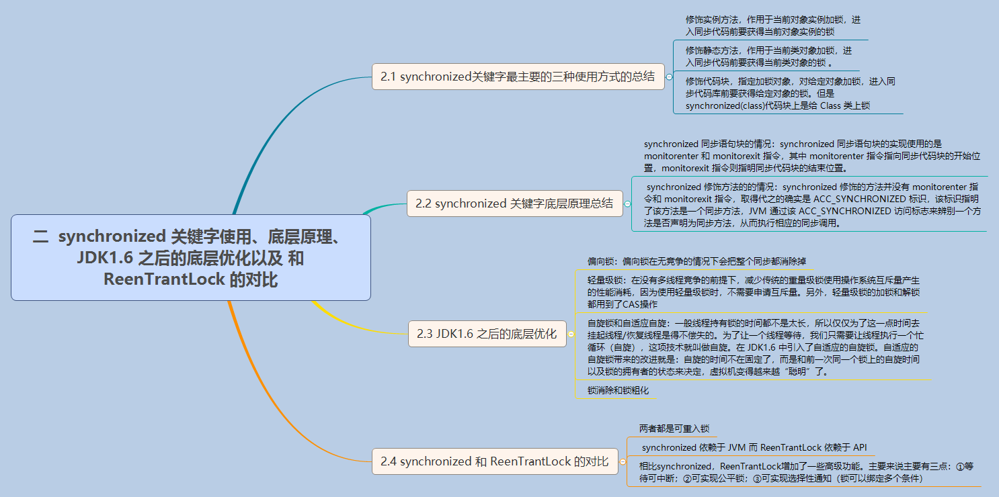
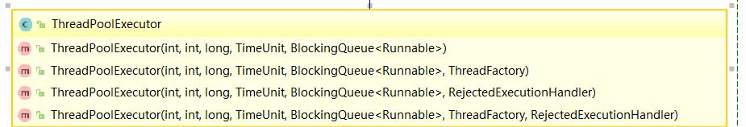
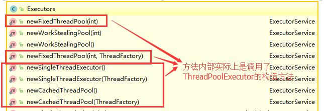
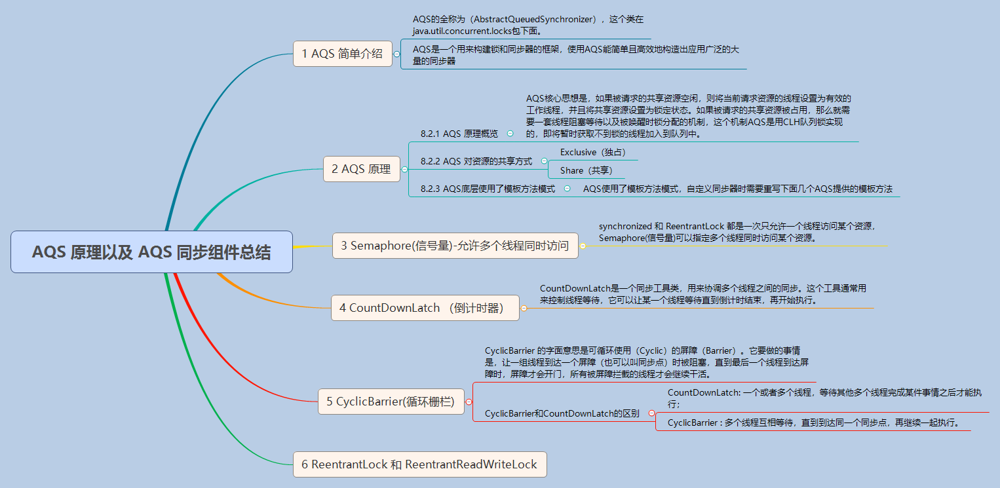

# 并发进阶
<!-- @import "[TOC]" {cmd="toc" depthFrom=1 depthTo=6 orderedList=false} -->
<!-- code_chunk_output -->

* [并发进阶](#并发进阶)
	* [synchronized 关键字](#synchronized-关键字)
		* [理解](#理解)
		* [说说自己是怎么使用 synchronized 关键字，在项目中用到了吗](#说说自己是怎么使用-synchronized-关键字在项目中用到了吗)
		* [单例模式了解吗？来给我手写一下！给我解释一下双重检验锁方式实现单例模式的原理呗！](#单例模式了解吗来给我手写一下给我解释一下双重检验锁方式实现单例模式的原理呗)
	* [讲一下 synchronized 关键字的底层原理](#讲一下-synchronized-关键字的底层原理)
		* [synchronized 同步语句块的情况](#synchronized-同步语句块的情况)
		* [synchronized 修饰方法的的情况](#synchronized-修饰方法的的情况)
	* [说说 JDK1.6 之后的synchronized 关键字底层做了哪些优化，可以详细介绍一下这些优化吗](#说说-jdk16-之后的synchronized-关键字底层做了哪些优化可以详细介绍一下这些优化吗)
		* [偏向锁](#偏向锁)
		* [轻量级锁](#轻量级锁)
		* [自旋锁和自适应自旋](#自旋锁和自适应自旋)
		* [锁消除](#锁消除)
		* [锁粗化](#锁粗化)
	* [谈谈 synchronized和ReentrantLock 的区别](#谈谈-synchronized和reentrantlock-的区别)
	* [volatile关键字](#volatile关键字)
		* [volatile作用](#volatile作用)
		* [说说 synchronized 关键字和 volatile 关键字的区别](#说说-synchronized-关键字和-volatile-关键字的区别)
	* [ThreadLocal](#threadlocal)
		* [什么是ThreadLocal](#什么是threadlocal)
		* [ThreadLocal 内存泄露问题](#threadlocal-内存泄露问题)
	* [线程池](#线程池)
		* [为什么要用线程池？](#为什么要用线程池)
		* [实现Runnable接口和Callable接口的区别](#实现runnable接口和callable接口的区别)
		* [执行execute()方法和submit()方法的区别是什么呢？](#执行execute方法和submit方法的区别是什么呢)
		* [如何创建线程池](#如何创建线程池)
	* [Atomic 原子类](#atomic-原子类)
		* [介绍一下Atomic 原子类](#介绍一下atomic-原子类)
		* [JUC 包中的原子类是哪4类?](#juc-包中的原子类是哪4类)
		* [讲讲 AtomicInteger 的使用](#讲讲-atomicinteger-的使用)
		* [AtomicInteger 类的原理](#atomicinteger-类的原理)
	* [AQS](#aqs)
		* [介绍](#介绍)
		* [AQS 原理概览](#aqs-原理概览)
		* [AQS 对资源的共享方式](#aqs-对资源的共享方式)
		* [AQS底层使用了模板方法模式](#aqs底层使用了模板方法模式)
		* [AQS 组件总结](#aqs-组件总结)

<!-- /code_chunk_output -->

## synchronized 关键字
### 理解
synchronized关键字解决的是多个线程之间访问资源的同步性，synchronized关键字可以保证被它修饰的方法或者代码块在任意时刻只能有一个线程执行。

### 说说自己是怎么使用 synchronized 关键字，在项目中用到了吗
- **修饰实例方法**: 作用于当前对象实例加锁，进入同步代码前要获得当前对象实例的锁
- **修饰静态方法**:也就是给当前类加锁，会作用于类的所有对象实例，因为静态成员不属于任何一个实例对象，是类成员（ static 表明这是该类的一个静态资源，不管new了多少个对象，只有一份）。所以如果一个线程A调用一个实例对象的非静态 synchronized 方法，而线程B需要调用这个实例对象所属类的静态 synchronized 方法，是允许的，不会发生互斥现象，因为访问静态 synchronized 方法占用的锁是当前类的锁，而访问非静态 synchronized 方法占用的锁是当前实例对象锁。
- **修饰代码块**: 指定加锁对象，对给定对象加锁，进入同步代码库前要获得给定对象的锁。
总结： **synchronized 关键字加到 static 静态方法和 synchronized(class)代码块上都是是给 Class 类上锁。synchronized 关键字加到实例方法上是给对象实例上锁。尽量不要使用 synchronized(String a) 因为JVM中，字符串常量池具有缓存功能！**

### 单例模式了解吗？来给我手写一下！给我解释一下双重检验锁方式实现单例模式的原理呗！
> 被volatile修饰的变量能够保证每个线程能够获取该变量的最新值，从而避免出现数据脏读的现象。


```java
public class Singleton {
    //volatile可以说是java虚拟机提供的最轻量级的同步机制,线程对volatile变量的修改会立刻被其他线程所感知，即不会出现数据脏读的现象，从而保证数据的“可见性”。
    private volatile static Singleton uniqueInstance;

    private Singleton() {
    }

    public static Singleton getUniqueInstance() {
       //先判断对象是否已经实例过，没有实例化过才进入加锁代码
        if (uniqueInstance == null) {
            //类对象加锁
            synchronized (Singleton.class) {
                if (uniqueInstance == null) {
                    uniqueInstance = new Singleton();
                }
            }
        }
        return uniqueInstance;
    }
}
```

uniqueInstance 采用 volatile 关键字修饰也是很有必要的， uniqueInstance = new Singleton(); 这段代码其实是分为三步执行：

1. 为 uniqueInstance 分配内存空间
2. 初始化 uniqueInstance
3. 将 uniqueInstance 指向分配的内存地址
但是由于 JVM 具有指令重排的特性，执行顺序有可能变成 1->3->2。指令重排在单线程环境下不会出先问题，但是在多线程环境下会导致一个线程获得还没有初始化的实例。例如，线程 T1 执行了 1 和 3，此时 T2 调用 getUniqueInstance() 后发现 uniqueInstance 不为空，因此返回 uniqueInstance，但此时 uniqueInstance 还未被初始化。

使用 volatile 可以禁止 JVM 的指令重排，保证在多线程环境下也能正常运行。

## 讲一下 synchronized 关键字的底层原理
###  synchronized 同步语句块的情况
```java
public class SynchronizedDemo {
	public void method() {
		synchronized (this) {
			System.out.println("synchronized 代码块");
		}
	}
}
```
**synchronized 同步语句块的实现使用的是 monitorenter 和 monitorexit 指令，其中 monitorenter 指令指向同步代码块的开始位置，monitorexit 指令则指明同步代码块的结束位置。** 当执行 monitorenter 指令时，线程试图获取锁也就是获取 monitor(monitor对象存在于每个Java对象的对象头中，synchronized 锁便是通过这种方式获取锁的，也是为什么Java中任意对象可以作为锁的原因) 的持有权。当计数器为0则可以成功获取，获取后将锁计数器设为1也就是加1。相应的在执行 monitorexit 指令后，将锁计数器设为0，表明锁被释放。如果获取对象锁失败，那当前线程就要阻塞等待，直到锁被另外一个线程释放为止。
### synchronized 修饰方法的的情况
```java
public class SynchronizedDemo2 {
	public synchronized void method() {
		System.out.println("synchronized 方法");
	}
}
```
synchronized 修饰的方法并没有 monitorenter 指令和 monitorexit 指令，取得代之的确实是 ACC_SYNCHRONIZED 标识，该标识指明了该方法是一个同步方法，JVM 通过该 ACC_SYNCHRONIZED 访问标志来辨别一个方法是否声明为同步方法，从而执行相应的同步调用。

## 说说 JDK1.6 之后的synchronized 关键字底层做了哪些优化，可以详细介绍一下这些优化吗
JDK1.6 对锁的实现引入了大量的优化，如**偏向锁**、**轻量级锁**、**自旋锁**、**适应性自旋锁**、**锁消除**、**锁粗化** 等技术来减少锁操作的开销。

锁主要存在四种状态，依次是：**无锁状态**、**偏向锁状态**、**轻量级锁状态**、**重量级锁状态**，他们会随着竞争的激烈而逐渐升级。注意**锁可以升级不可降级**，这种策略是为了提高获得锁和释放锁的效率。

### 偏向锁
引入偏向锁的目的和引入轻量级锁的目的很像，他们都是为了没有多线程竞争的前提下，减少传统的重量级锁使用操作系统互斥量产生的性能消耗。但是不同是：**轻量级锁在无竞争的情况下使用 CAS 操作去代替使用互斥量。而偏向锁在无竞争的情况下会把整个同步都消除掉。**

偏向锁的“偏”就是偏心的偏，它的意思是会偏向于第一个获得它的线程，如果在接下来的执行中，该锁没有被其他线程获取，那么持有偏向锁的线程就不需要进行同步！关于偏向锁的原理可以查看《深入理解Java虚拟机：JVM高级特性与最佳实践》第二版的13章第三节锁优化。

但是对于锁竞争比较激烈的场合，偏向锁就失效了，因为这样场合极有可能每次申请锁的线程都是不相同的，因此这种场合下不应该使用偏向锁，否则会得不偿失，需要注意的是，偏向锁失败后，并不会立即膨胀为重量级锁，而是先升级为轻量级锁。

### 轻量级锁

倘若偏向锁失败，虚拟机并不会立即升级为重量级锁，它还会尝试使用一种称为轻量级锁的优化手段(1.6之后加入的)。轻量级锁不是为了代替重量级锁，它的本意是在没有多线程竞争的前提下，减少传统的重量级锁使用操作系统互斥量产生的性能消耗，因为**使用轻量级锁时，不需要申请互斥量**。另外，**轻量级锁的加锁和解锁都用到了CAS操作**。 关于轻量级锁的加锁和解锁的原理可以查看《深入理解Java虚拟机：JVM高级特性与最佳实践》第二版的13章第三节锁优化。

轻量级锁能够提升程序同步性能的依据是“对于绝大部分锁，在整个同步周期内都是不存在竞争的”，这是一个经验数据。如果没有竞争，轻量级锁使用 CAS 操作避免了使用互斥操作的开销。但如果存在锁竞争，除了互斥量开销外，还会额外发生CAS操作，因此在有锁竞争的情况下，轻量级锁比传统的重量级锁更慢！如果锁竞争激烈，那么轻量级将很快膨胀为重量级锁！

### 自旋锁和自适应自旋
轻量级锁失败后，虚拟机为了避免线程真实地在操作系统层面挂起，还会进行一项称为自旋锁的优化手段。

**互斥同步对性能最大的影响就是阻塞的实现**，因为挂起线程/恢复线程的操作都需要转入内核态中完成（用户态转换到内核态会耗费时间）。

**一般线程持有锁的时间都不是太长，所以仅仅为了这一点时间去挂起线程/恢复线程是得不偿失的**。 所以，虚拟机的开发团队就这样去考虑：“我们能不能让后面来的请求获取锁的线程等待一会而不被挂起呢？看看持有锁的线程是否很快就会释放锁”。**为了让一个线程等待，我们只需要让线程执行一个忙循环（自旋），这项技术就叫做自旋**。

自旋锁在 JDK1.6 之前其实就已经引入了，不过是默认关闭的，需要通过--XX:+UseSpinning参数来开启。JDK1.6及1.6之后，就改为默认开启的了。需要注意的是：自旋等待不能完全替代阻塞，因为它还是要占用处理器时间。如果锁被占用的时间短，那么效果当然就很好了！反之，相反！自旋等待的时间必须要有限度。如果自旋超过了限定次数任然没有获得锁，就应该挂起线程。自旋次数的默认值是10次，用户可以修改--XX:PreBlockSpin来更改。

另外,在 JDK1.6 中引入了自适应的自旋锁。自适应的自旋锁带来的改进就是：**自旋的时间不在固定了，而是和前一次同一个锁上的自旋时间以及锁的拥有者的状态来决定，虚拟机变得越来越“聪明”了。**

### 锁消除
锁消除理解起来很简单，它指的就是虚拟机即使编译器在运行时，如果检测到那些共享数据不可能存在竞争，那么就执行锁消除。锁消除可以节省毫无意义的请求锁的时间。

### 锁粗化
原则上，我们在编写代码的时候，总是推荐将同步块的作用范围限制得尽量小，——直在共享数据的实际作用域才进行同步，这样是为了使得需要同步的操作数量尽可能变小，如果存在锁竞争，那等待线程也能尽快拿到锁。

大部分情况下，上面的原则都是没有问题的，但是如果一系列的连续操作都对同一个对象反复加锁和解锁，那么会带来很多不必要的性能消耗。




## 谈谈 synchronized和ReentrantLock 的区别

1. **两者都是可重入锁**
    - 两者都是可重入锁。“可重入锁”概念是：**自己可以再次获取自己的内部锁**。比如一个线程获得了某个对象的锁，此时这个对象锁还没有释放，当其再次想要获取这个对象的锁的时候还是可以获取的，如果不可锁重入的话，就会造成死锁。同一个线程每次获取锁，锁的计数器都自增1，所以要等到锁的计数器下降为0时才能释放锁。
2. **synchronized 依赖于 JVM 而 ReentrantLock 依赖于 API**
3. **ReentrantLock 比 synchronized 增加了一些高级功能**
    - 等待可中断
      - ReentrantLock提供了一种能够中断等待锁的线程的机制，通过lock.lockInterruptibly()来实现这个机制。也就是说正在等待的线程可以选择放弃等待，改为处理其他事情。
    - 可实现公平锁
      - ReentrantLock可以指定是公平锁还是非公平锁（默认）。
      - 而synchronized只能是非公平锁。
    - 可实现选择性通知（锁可以绑定多个条件）
      - 线程对象可以注册在指定的Condition中，从而可以有选择性的进行线程通知，在调度线程上更加灵活。 在使用notify()/notifyAll()方法进行通知时，被通知的线程是由 JVM 选择的，用ReentrantLock类结合Condition实例可以实现“选择性通知”。
      - 而synchronized关键字就相当于整个Lock对象中只有一个Condition实例，所有的线程都注册在它一个身上。如果执行notifyAll()方法的话就会通知所有处于等待状态的线程这样会造成很大的效率问题，而Condition实例的signalAll()方法 只会唤醒注册在该Condition实例中的所有等待线程。
4. **性能已不是选择标准**

## volatile关键字
### volatile作用
 volatile 关键字的主要作用就是
 - 保证变量的可见性
 - 防止指令重排序
### 说说 synchronized 关键字和 volatile 关键字的区别
- volatile关键字是线程同步的轻量级实现，所以volatile**性能**肯定比synchronized关键字要好。但是**volatile关键字只能用于变量而synchronized关键字可以修饰方法以及代码块**。
- **多线程访问volatile关键字不会发生阻塞，而synchronized关键字可能会发生阻塞**
- **volatile关键字能保证数据的可见性，但不能保证数据的原子性。synchronized关键字两者都能保证。**
- **volatile关键字主要用于解决变量在多个线程之间的可见性，而 synchronized关键字解决的是多个线程之间访问资源的同步性。**

## ThreadLocal
### 什么是ThreadLocal
**让每个线程绑定自己的值，可以将ThreadLocal类形象的比喻成存放数据的盒子，盒子中可以存储每个线程的私有数据。**

**如果你创建了一个ThreadLocal变量，那么访问这个变量的每个线程都会有这个变量的本地副本，这也是ThreadLocal变量名的由来。他们可以使用 get（） 和 set（） 方法来获取默认值或将其值更改为当前线程所存的副本的值，从而避免了线程安全问题。**

```java
import java.text.SimpleDateFormat;
import java.util.Random;

public class ThreadLocalExample implements Runnable{

     // SimpleDateFormat 不是线程安全的，所以每个线程都要有自己独立的副本
    private static final ThreadLocal<SimpleDateFormat> formatter = ThreadLocal.withInitial(() -> new SimpleDateFormat("yyyyMMdd HHmm"));

    public static void main(String[] args) throws InterruptedException {
        ThreadLocalExample obj = new ThreadLocalExample();
        for(int i=0 ; i<10; i++){
            Thread t = new Thread(obj, ""+i);
            Thread.sleep(new Random().nextInt(1000));
            t.start();
        }
    }

    @Override
    public void run() {
        System.out.println("Thread Name= "+Thread.currentThread().getName()+" default Formatter = "+formatter.get().toPattern());
        try {
            Thread.sleep(new Random().nextInt(1000));
        } catch (InterruptedException e) {
            e.printStackTrace();
        }
        //formatter pattern is changed here by thread, but it won't reflect to other threads
        formatter.set(new SimpleDateFormat());

        System.out.println("Thread Name= "+Thread.currentThread().getName()+" formatter = "+formatter.get().toPattern());
    }

}
```

ThreadLocal类的set()方法
```java
public void set(T value) {
    Thread t = Thread.currentThread();
    ThreadLocalMap map = getMap(t);
    if (map != null)
        map.set(this, value);
    else
        createMap(t, value);
}
ThreadLocalMap getMap(Thread t) {
    return t.threadLocals;
}
```
**最终的变量是放在了当前线程的 ThreadLocalMap 中，并不是存在 ThreadLocal 上，ThreadLocal 可以理解为只是ThreadLocalMap的封装，传递了变量值。**

**每个Thread中都具备一个ThreadLocalMap，而ThreadLocalMap可以存储以ThreadLocal为key的键值对。这里解释了为什么每个线程访问同一个ThreadLocal，得到的确是不同的数值。另外，ThreadLocal 是 map结构是为了让每个线程可以关联多个 ThreadLocal变量。**

### ThreadLocal 内存泄露问题
ThreadLocalMap 中
-  key 为 ThreadLocal 的弱引用,而
-  value 是强引用。

所以，如果 ThreadLocal 没有被外部强引用的情况下，在垃圾回收的时候会 key 会被清理掉，而 value 不会被清理掉。这样一来，ThreadLocalMap 中就会出现key为null的Entry。假如我们不做任何措施的话，value 永远无法被GC 回收，这个时候就可能会产生内存泄露。

ThreadLocalMap实现中已经考虑了这种情况，在调用 set()、get()、remove() 方法的时候，会清理掉 key 为 null 的记录。使用完 ThreadLocal方法后 最好手动调用remove()方法

## 线程池
### 为什么要用线程池？
- **降低资源消耗。** 通过重复利用已创建的线程降低线程创建和销毁造成的消耗。
- **提高响应速度。** 当任务到达时，任务可以不需要的等到线程创建就能立即执行。
- **提高线程的可管理性。** 线程是稀缺资源，如果无限制的创建，不仅会消耗系统资源，还会降低系统的稳定性，使用线程池可以进行统一的分配，调优和监控。

### 实现Runnable接口和Callable接口的区别
如果想让线程池执行任务的话需要实现的Runnable接口或Callable接口。 Runnable接口或Callable接口实现类都可以被ThreadPoolExecutor或ScheduledThreadPoolExecutor执行。两者的区别在于
- **Runnable 接口不会返回结果**
- **Callable 接口可以返回结果**
> 备注： 工具类Executors可以实现Runnable对象和Callable对象之间的相互转换。（Executors.callable（Runnable task）或Executors.callable（Runnable task，Object resule））

### 执行execute()方法和submit()方法的区别是什么呢？

- execute() 方法用于提交不需要返回值的任务，所以无法判断任务是否被线程池执行成功与否；
- submit() 方法用于提交需要返回值的任务。线程池会返回一个Future类型的对象，通过这个Future对象可以判断任务是否执行成功，并且可以通过future的get()方法来获取返回值，get()方法会阻塞当前线程直到任务完成，而使用 get（long timeout，TimeUnit unit）方法则会阻塞当前线程一段时间后立即返回，这时候有可能任务没有执行完。

### 如何创建线程池
《阿里巴巴Java开发手册》中强制线程池不允许使用 Executors 去创建，而是通过 **ThreadPoolExecutor** 的方式，这样的处理方式让写的同学更加明确线程池的运行规则，规避资源耗尽的风险

> Executors 返回线程池对象的弊端如下：
> - FixedThreadPool 和 SingleThreadExecutor ： 允许请求的队列长度为 Integer.MAX_VALUE ，可能堆积大量的请求，从而导致OOM。
> - CachedThreadPool 和 ScheduledThreadPool ： 允许创建的线程数量为 Integer.MAX_VALUE ，可能会创建大量线程，从而导致OOM。

**方式一：通过构造方法实现**

**方式二：通过Executor 框架的工具类Executors来实现 我们可以创建三种类型的ThreadPoolExecutor**
- **FixedThreadPool**:该方法返回一个固定线程数量的线程池。该线程池中的线程数量始终不变。当有一个新的任务提交时，线程池中若有空闲线程，则立即执行。若没有，则新的任务会被暂存在一个任务队列中，待有线程空闲时，便处理在任务队列中的任务。
- **SingleThreadExecutor**： 方法返回一个只有一个线程的线程池。若多余一个任务被提交到该线程池，任务会被保存在一个任务队列中，待线程空闲，按先入先出的顺序执行队列中的任务。
- **CachedThreadPool**： 该方法返回一个可根据实际情况调整线程数量的线程池。线程池的线程数量不确定，但若有空闲线程可以复用，则会优先使用可复用的线程。若所有线程均在工作，又有新的任务提交，则会创建新的线程处理任务。所有线程在当前任务执行完毕后，将返回线程池进行复用。



## Atomic 原子类
### 介绍一下Atomic 原子类
Atomic 是指一个操作是不可中断的。即使是在多个线程一起执行的时候，一个操作一旦开始，就不会被其他线程干扰。

所以，所谓原子类说简单点就是具有原子/原子操作特征的类。

### JUC 包中的原子类是哪4类?
- 基本类型
  - AtomicInteger：整形原子类
  - AtomicLong：长整型原子类
  - AtomicBoolean：布尔型原子类
- 数组类型
  - AtomicIntegerArray：整形数组原子类
  - AtomicLongArray：长整形数组原子类
  - AtomicReferenceArray：引用类型数组原子类
- 引用类型
  - AtomicReference：引用类型原子类
  - AtomicStampedReference：原子更新引用类型里的字段原子类
  - AtomicMarkableReference ：原子更新带有标记位的引用类型
- 对象的属性修改类型
  - AtomicIntegerFieldUpdater：原子更新整形字段的更新器
  - AtomicLongFieldUpdater：原子更新长整形字段的更新器
  - AtomicStampedReference：原子更新带有版本号的引用类型。该类将整数值与引用关联起来，可用于解决原子的更新数据和数据的版本号，可以解决使用 CAS 进行原子更新时可能出现的 ABA 问题。

### 讲讲 AtomicInteger 的使用
AtomicInteger 类常用方法
```java
public final int get() //获取当前的值
public final int getAndSet(int newValue)//获取当前的值，并设置新的值
public final int getAndIncrement()//获取当前的值，并自增
public final int getAndDecrement() //获取当前的值，并自减
public final int getAndAdd(int delta) //获取当前的值，并加上预期的值
boolean compareAndSet(int expect, int update) //如果输入的数值等于预期值，则以原子方式将该值设置为输入值（update）
public final void lazySet(int newValue)//最终设置为newValue,使用 lazySet 设置之后可能导致其他线程在之后的一小段时间内还是可以读到旧的值。
```
AtomicInteger 类的使用示例

> 使用 AtomicInteger 之后，不用对 increment() 方法加锁也可以保证线程安全。
```java
class AtomicIntegerTest {
        private AtomicInteger count = new AtomicInteger();
      //使用AtomicInteger之后，不需要对该方法加锁，也可以实现线程安全。
        public void increment() {
                  count.incrementAndGet();
        }

       public int getCount() {
                return count.get();
        }
}
```
### AtomicInteger 类的原理
```java
// setup to use Unsafe.compareAndSwapInt for updates（更新操作时提供“比较并替换”的作用）
private static final Unsafe unsafe = Unsafe.getUnsafe();
private static final long valueOffset;

static {
    try {
        valueOffset = unsafe.objectFieldOffset
            (AtomicInteger.class.getDeclaredField("value"));
    } catch (Exception ex) { throw new Error(ex); }
}

private volatile int value;
```

AtomicInteger 类主要利用 CAS (compare and swap) + volatile 和 native 方法来保证原子操作，从而避免 synchronized 的高开销，执行效率大为提升。

CAS的原理是拿期望的值和原本的一个值作比较，如果相同则更新成新的值。UnSafe 类的 objectFieldOffset() 方法是一个本地方法，这个方法是用来拿到“原来的值”的内存地址，返回值是 valueOffset。另外 value 是一个volatile变量，在内存中可见，因此 JVM 可以保证任何时刻任何线程总能拿到该变量的最新值。

## AQS
### 介绍
AQS的全称为（AbstractQueuedSynchronizer），这个类在java.util.concurrent.locks包下面。

**AQS是一个用来构建锁和同步器的框架**，使用AQS能简单且高效地构造出应用广泛的大量的同步器，比如我们提到的ReentrantLock，Semaphore，其他的诸如ReentrantReadWriteLock，SynchronousQueue，FutureTask等等皆是基于AQS的。当然，我们自己也能利用AQS非常轻松容易地构造出符合我们自己需求的同步器。

### AQS 原理概览
**如果被请求的共享资源空闲，则将当前请求资源的线程设置为有效的工作线程，并且将共享资源设置为锁定状态。如果被请求的共享资源被占用，那么就需要一套线程阻塞等待以及被唤醒时锁分配的机制，这个机制AQS是用CLH队列锁实现的，即将暂时获取不到锁的线程加入到队列中。**
> CLH(Craig,Landin,and Hagersten)队列是一个虚拟的双向队列（虚拟的双向队列即不存在队列实例，仅存在结点之间的关联关系）。AQS是将每条请求共享资源的线程封装成一个CLH锁队列的一个结点（Node）来实现锁的分配。


AQS使用一个int成员变量来表示同步状态，通过内置的FIFO队列来完成获取资源线程的排队工作。AQS使用CAS对该同步状态进行原子操作实现对其值的修改。
```java
private volatile int state;//共享变量，使用volatile修饰保证线程可见性
```
状态信息通过protected类型的getState，setState，compareAndSetState进行操作
```java
//返回同步状态的当前值
protected final int getState() {
        return state;
}
 // 设置同步状态的值
protected final void setState(int newState) {
        state = newState;
}
//原子地（CAS操作）将同步状态值设置为给定值update如果当前同步状态的值等于expect（期望值）
protected final boolean compareAndSetState(int expect, int update) {
        return unsafe.compareAndSwapInt(this, stateOffset, expect, update);
}
```
### AQS 对资源的共享方式
- **Exclusive（独占）**：只有一个线程能执行，如ReentrantLock。又可分为公平锁和非公平锁：
公平锁：按照线程在队列中的排队顺序，先到者先拿到锁
非公平锁：当线程要获取锁时，无视队列顺序直接去抢锁，谁抢到就是谁的
- **Share（共享）**：多个线程可同时执行，如Semaphore/CountDownLatch。Semaphore、CountDownLatch、 CyclicBarrier、ReadWriteLock 我们都会在后面讲到。

ReentrantReadWriteLock 可以看成是组合式，因为ReentrantReadWriteLock也就是读写锁允许多个线程同时对某一资源进行读。

不同的自定义同步器争用共享资源的方式也不同。自定义同步器在实现时只需要实现共享资源 state 的获取与释放方式即可，至于具体线程等待队列的维护（如获取资源失败入队/唤醒出队等），AQS已经在顶层实现好了。


### AQS底层使用了模板方法模式
同步器的设计是基于模板方法模式的，如果需要自定义同步器一般的方式是这样（模板方法模式很经典的一个应用）：

- 使用者继承AbstractQueuedSynchronizer并重写指定的方法。（这些重写方法很简单，无非是对于共享资源state的获取和释放）
- 将AQS组合在自定义同步组件的实现中，并调用其模板方法，而这些模板方法会调用使用者重写的方法。


这和我们以往通过实现接口的方式有很大区别，这是模板方法模式很经典的一个运用。
**AQS使用了模板方法模式，自定义同步器时需要重写下面几个AQS提供的模板方法：**
```java
isHeldExclusively()//该线程是否正在独占资源。只有用到condition才需要去实现它。
tryAcquire(int)//独占方式。尝试获取资源，成功则返回true，失败则返回false。
tryRelease(int)//独占方式。尝试释放资源，成功则返回true，失败则返回false。
tryAcquireShared(int)//共享方式。尝试获取资源。负数表示失败；0表示成功，但没有剩余可用资源；正数表示成功，且有剩余资源。
tryReleaseShared(int)//共享方式。尝试释放资源，成功则返回true，失败则返回false。
```
默认情况下，每个方法都抛出 UnsupportedOperationException。 这些方法的实现必须是内部线程安全的，并且通常应该简短而不是阻塞。AQS类中的其他方法都是final ，所以无法被其他类使用，只有这几个方法可以被其他类使用。

以ReentrantLock为例，state初始化为0，表示未锁定状态。A线程lock()时，会调用tryAcquire()独占该锁并将state+1。此后，其他线程再tryAcquire()时就会失败，直到A线程unlock()到state=0（即释放锁）为止，其它线程才有机会获取该锁。当然，释放锁之前，A线程自己是可以重复获取此锁的（state会累加），这就是可重入的概念。但要注意，获取多少次就要释放多么次，这样才能保证state是能回到零态的。

再以CountDownLatch以例，任务分为N个子线程去执行，state也初始化为N（注意N要与线程个数一致）。这N个子线程是并行执行的，每个子线程执行完后countDown()一次，state会CAS(Compare and Swap)减1。等到所有子线程都执行完后(即state=0)，会unpark()主调用线程，然后主调用线程就会从await()函数返回，继续后余动作。

一般来说，自定义同步器要么是独占方法，要么是共享方式，他们也只需实现tryAcquire-tryRelease、tryAcquireShared-tryReleaseShared中的一种即可。但AQS也支持自定义同步器同时实现独占和共享两种方式，如ReentrantReadWriteLock。

### AQS 组件总结
- **Semaphore(信号量)**-允许多个线程同时访问： synchronized 和 ReentrantLock 都是一次只允许一个线程访问某个资源，Semaphore(信号量)可以指定多个线程同时访问某个资源。
  - Semaphore 有两种模式，公平模式和非公平模式。
    - 公平模式： 调用acquire的顺序就是获取许可证的顺序，遵循FIFO；
    - 非公平模式： 抢占式的。
- **CountDownLatch （倒计时器）**： CountDownLatch是一个同步工具类，用来协调多个线程之间的同步。这个工具通常用来控制线程等待，它可以让某一个线程等待直到倒计时结束，再开始执行。
  - **某一线程在开始运行前等待n个线程执行完毕**。将 CountDownLatch 的计数器初始化为n ：new CountDownLatch(n) ，每当一个任务线程执行完毕，就将计数器减1 countdownlatch.countDown()，当计数器的值变为0时，在CountDownLatch上 await() 的线程就会被唤醒。一个典型应用场景就是启动一个服务时，主线程需要等待多个组件加载完毕，之后再继续执行。
  - **实现多个线程开始执行任务的最大并行性**。注意是并行性，不是并发，强调的是多个线程在某一时刻同时开始执行。类似于赛跑，将多个线程放到起点，等待发令枪响，然后同时开跑。做法是初始化一个共享的 CountDownLatch 对象，将其计数器初始化为 1 ：new CountDownLatch(1) ，多个线程在开始执行任务前首先 coundownlatch.await()，当主线程调用 countDown() 时，计数器变为0，多个线程同时被唤醒。
  - **死锁检测**：一个非常方便的使用场景是，你可以使用n个线程访问共享资源，在每次测试阶段的线程数目是不同的，并尝试产生死锁。
- **CyclicBarrier(循环栅栏)**： CyclicBarrier 和 CountDownLatch 非常类似，它也可以实现线程间的技术等待，但是它的功能比 CountDownLatch 更加复杂和强大。主要应用场景和 CountDownLatch 类似。CyclicBarrier 的字面意思是可循环使用（Cyclic）的屏障（Barrier）。它要做的事情是，让一组线程到达一个屏障（也可以叫同步点）时被阻塞，直到最后一个线程到达屏障时，屏障才会开门，所有被屏障拦截的线程才会继续干活。CyclicBarrier默认的构造方法是 CyclicBarrier(int parties)，其参数表示屏障拦截的线程数量，每个线程调用await()方法告诉 CyclicBarrier 我已经到达了屏障，然后当前线程被阻塞。
