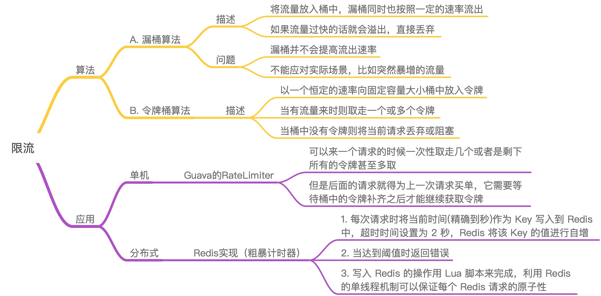
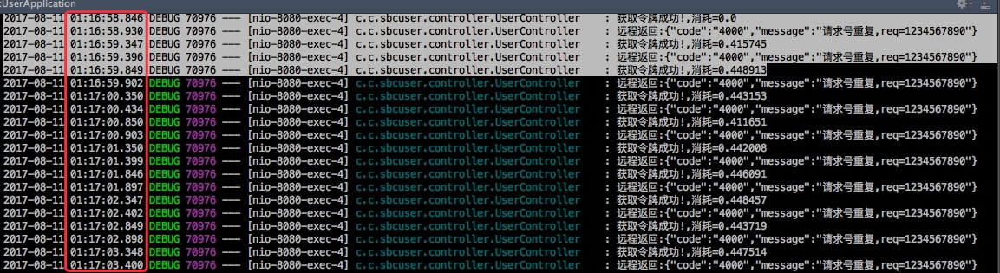

# 应用限流

<!-- @import "[TOC]" {cmd="toc" depthFrom=2 depthTo=6 orderedList=false} -->
<!-- code_chunk_output -->

* [思维导图](#思维导图)
* [常见算法](#常见算法)
	* [漏桶算法](#漏桶算法)
	* [令牌桶算法](#令牌桶算法)
* [单机应用的RateLimiter实现](#单机应用的ratelimiter实现)
* [分布式Redis实现](#分布式redis实现)
	* [实现原理（粗暴的计数器，未实现令牌桶）](#实现原理粗暴的计数器未实现令牌桶)
	* [示例](#示例)
* [引用](#引用)

<!-- /code_chunk_output -->

## 思维导图



## 常见算法

对于限流常见有两种算法:

- 漏桶算法
- 令牌桶算法

### 漏桶算法

漏桶算法比较简单，就是将流量放入桶中，漏桶同时也按照一定的速率流出，如果流量过快的话就会溢出(`漏桶并不会提高流出速率`)。溢出的流量则直接丢弃。

如下图所示:


这种做法简单粗暴。

`漏桶算法`虽说简单，但却不能应对实际场景，比如突然暴增的流量。

### 令牌桶算法

`令牌桶`会以一个恒定的速率向固定容量大小桶中放入令牌，当有流量来时则取走一个或多个令牌。当桶中没有令牌则将当前请求丢弃或阻塞。


>  相比之下令牌桶可以应对一定的突发流量.

## 单机应用的RateLimiter实现

对于令牌桶的代码实现，可以直接使用`Guava`包中的`RateLimiter`。

参考项目[UserController](https://github.com/crossoverJie/springboot-cloud/blob/master/sbc-user/user/src/main/java/com/crossoverJie/sbcuser/controller/UserController.java#L82:L105)

```java
@Override
public BaseResponse<UserResVO> getUserByFeignBatch(@RequestBody UserReqVO userReqVO) {
    //调用远程服务
    OrderNoReqVO vo = new OrderNoReqVO() ;
    vo.setReqNo(userReqVO.getReqNo());

    RateLimiter limiter = RateLimiter.create(2.0) ;
    //批量调用
    for (int i = 0 ;i< 10 ; i++){
        double acquire = limiter.acquire();
        logger.debug("获取令牌成功!,消耗=" + acquire);
        BaseResponse<OrderNoResVO> orderNo = orderServiceClient.getOrderNo(vo);
        logger.debug("远程返回:"+JSON.toJSONString(orderNo));
    }

    UserRes userRes = new UserRes() ;
    userRes.setUserId(123);
    userRes.setUserName("张三");

    userRes.setReqNo(userReqVO.getReqNo());
    userRes.setCode(StatusEnum.SUCCESS.getCode());
    userRes.setMessage("成功");

    return userRes ;
}
```

调用结果如下:



代码可以看出以每秒向桶中放入两个令牌，请求一次消耗一个令牌。所以每秒钟只能发送两个请求。按照图中的时间来看也确实如此(返回值是获取此令牌所消耗的时间，差不多也是每500ms一个)。

使用`RateLimiter`有几个值得注意的地方:

允许`先消费，后付款`，意思就是它可以来一个请求的时候一次性取走几个或者是剩下所有的令牌甚至多取，但是后面的请求就得为上一次请求买单，它需要等待桶中的令牌补齐之后才能继续获取令牌。


## 分布式Redis实现

### 实现原理（粗暴的计数器，未实现令牌桶）

既然要达到分布式全局限流的效果，那自然需要一个第三方组件来记录请求的次数。

- 每次请求时将当前时间(精确到秒)作为 Key 写入到 Redis 中，超时时间设置为 2 秒，Redis 将该 Key 的值进行自增。
- 当达到阈值时返回错误。
- 写入 Redis 的操作用 Lua 脚本来完成，利用 Redis 的单线程机制可以保证每个 Redis 请求的原子性。

### 示例

感谢大佬的组件 [https://github.com/crossoverJie/distributed-redis-tool](https://github.com/crossoverJie/distributed-redis-tool)

感谢大佬的demo[https://github.com/crossoverJie/springboot-cloud](https://github.com/crossoverJie/springboot-cloud)


## 引用

[https://crossoverjie.top/2017/08/11/sbc4/](https://crossoverjie.top/2017/08/11/sbc4/)

[https://crossoverjie.top/2018/04/28/sbc/sbc7-Distributed-Limit/](https://crossoverjie.top/2018/04/28/sbc/sbc7-Distributed-Limit/)
