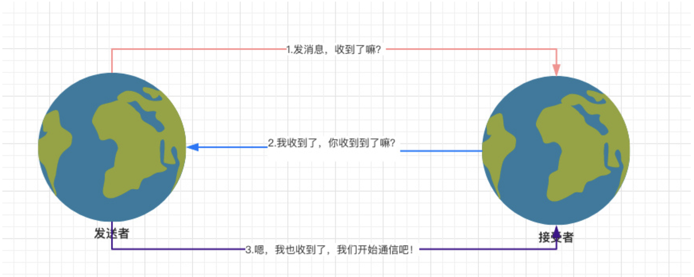

# 三次握手

<!-- @import "[TOC]" {cmd="toc" depthFrom=2 depthTo=6 orderedList=false} -->
<!-- code_chunk_output -->

* [三次握手](#三次握手-1)
* [超时重发](#超时重发)
* [滑动窗口](#滑动窗口)

<!-- /code_chunk_output -->

## 三次握手

详细[三次握手、四次挥手](https://gknoone.github.io/java-interview/#/%E5%9F%BA%E7%A1%80%E7%9F%A5%E8%AF%86/TCPIP/%E4%B8%89%E6%AC%A1%E6%8F%A1%E6%89%8B%E3%80%81%E5%9B%9B%E6%AC%A1%E6%8C%A5%E6%89%8B)

## 超时重发

当发送者向接收者发包后，如果过了一段时间(超时时间)依然没有收到消息，就当做本次包丢失，需要重新补发。

并且如果一次性发了三个包，只要最后一个包确认收到之后就默认前面两个也收到了。

## 滑动窗口

假设一次性发送包的大小为3，那么每次可以发3个包，而且可以边发边接收，这样就会增强效率。这里的 3 就是滑动窗口的大小，这样的发送方式也叫滑动窗口协议。
