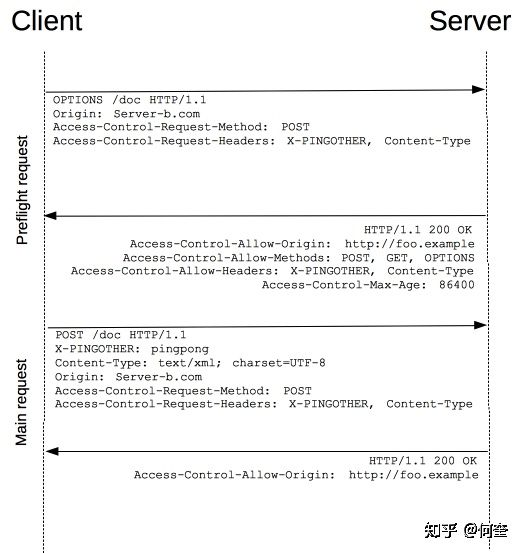
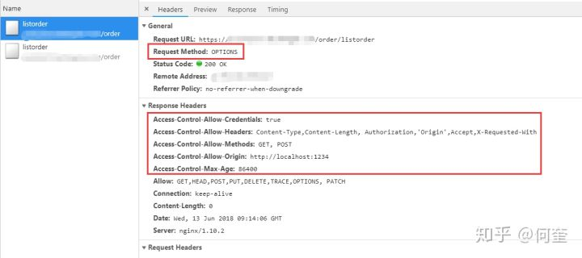

# CROS跨域原理
<!-- @import "[TOC]" {cmd="toc" depthFrom=2 depthTo=6 orderedList=false} -->
<!-- code_chunk_output -->

* [CROS跨域流程](#cros跨域流程)
* [CROS服务端配置](#cros服务端配置)

<!-- /code_chunk_output -->
## CROS跨域流程

1、浏览器接收到脚本发起的请求（资源B），

2、发送一个简单的预检请求(OPTIONS)到资源B所在服务器

3、资源B服务器响应，告诉浏览器该请求(包括请求域，请求方法)可通行

4、浏览器发送完整请求到资源B服务器

5、资源B服务器响应，返回完整请求



## CROS服务端配置



```
Access-Control-Allow-Origin: <origin> | *
```

origin 参数的值指定了允许访问该资源的外域 URI，可以指定该字段的值为通配符（*），表示允许来自所有域的请求。

```
Access-Control-Allow-Methods: <method>[, <method>]*
```

指明了实际请求所允许使用的 HTTP 方法。

```
Access-Control-Allow-Headers: <field-name>[, <field-name>]*
```

指明了实际请求中允许携带的首部字段

```text
Access-Control-Allow-Credentials: true
```

一般而言，对于跨域 `XMLHttpRequest`或 [Fetch](https://link.zhihu.com/?target=https%3A//developer.mozilla.org/en-US/docs/Web/API/Fetch_API) 请求，浏览器**不会**发送身份凭证信息。如果要发送凭证信息，需要设置为true。

```text
Access-Control-Max-Age: <delta-seconds>
```

指定预检请求的缓存时间（单位：秒），有效期内的后续该请求不再进行预检。若不设置则每次请求都需要先发起预检。
