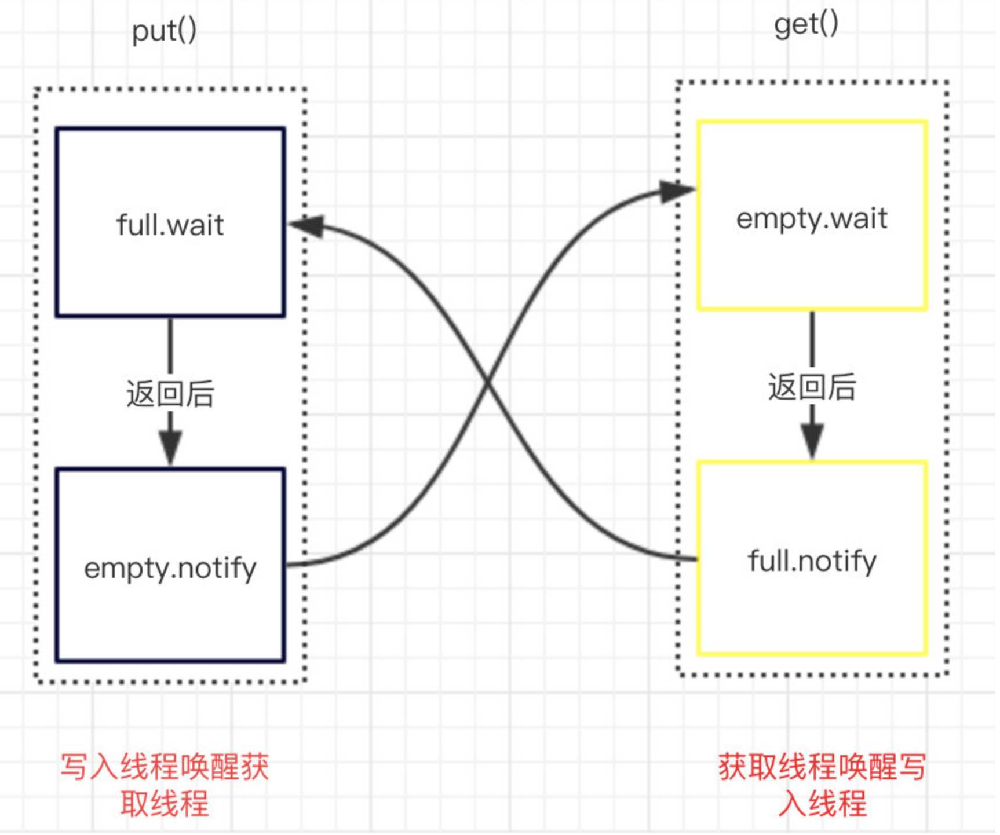

# 阻塞队列

## 阻塞基础



- 写入队列满时会阻塞直到获取线程消费了队列数据后唤醒**写入线程**。
- 消费队列空时会阻塞直到写入线程写入了队列数据后唤醒**消费线程**。

## ArrayBlockingQueue

### 初始化队列

```java
public ArrayBlockingQueue(int capacity) {
  this(capacity, false);
}

public ArrayBlockingQueue(int capacity, boolean fair) {
  if (capacity <= 0)
    throw new IllegalArgumentException();
  this.items = new Object[capacity];
  lock = new ReentrantLock(fair);
  notEmpty = lock.newCondition();
  notFull =  lock.newCondition();
}
```

1. 初始化一个队列大小的数组。
2. 初始化了一个重入锁；在初始化重入锁的时候默认是`非公平锁`，当然也可以指定为 `true` 使用公平锁；这样就会按照队列的顺序进行写入和消费。

3. 创建了 `notEmpty notFull` 这两个条件，他的作用于用法和之前使用的 `object.wait/notify` 类似。

### 写入队列

```java
public void put(E e) throws InterruptedException {
    checkNotNull(e);
    final ReentrantLock lock = this.lock;
    lock.lockInterruptibly();
    try {
        while (count == items.length)
          	//写满了阻塞,等待
            notFull.await();
        enqueue(e);
    } finally {
        lock.unlock();
    }
}
private void enqueue(E x) {
  // assert lock.getHoldCount() == 1;
  // assert items[putIndex] == null;
  final Object[] items = this.items;
  items[putIndex] = x;
  if (++putIndex == items.length)
    putIndex = 0;
  count++;
  //通知
  notEmpty.signal();
}
/**
 * 一个具有超时时间的等待方法
*/
public boolean offer(E e, long timeout, TimeUnit unit)
  throws InterruptedException {

  checkNotNull(e);
  long nanos = unit.toNanos(timeout);
  final ReentrantLock lock = this.lock;
  lock.lockInterruptibly();
  try {
    while (count == items.length) {
      if (nanos <= 0)
        return false;
      nanos = notFull.awaitNanos(nanos);
    }
    enqueue(e);
    return true;
  } finally {
    lock.unlock();
  }
}
```

### 消费队列

```java
public E take() throws InterruptedException {
    final ReentrantLock lock = this.lock;
    lock.lockInterruptibly();
    try {
        while (count == 0)
          // 没有数据的时候，等待
            notEmpty.await();
        return dequeue();
    } finally {
        lock.unlock();
    }
}
private E dequeue() {
  // assert lock.getHoldCount() == 1;
  // assert items[takeIndex] != null;
  final Object[] items = this.items;
  @SuppressWarnings("unchecked")
  E x = (E) items[takeIndex];
  items[takeIndex] = null;
  if (++takeIndex == items.length)
    takeIndex = 0;
  count--;
  if (itrs != null)
    itrs.elementDequeued();
  // 通知
  notFull.signal();
  return x;
}
```