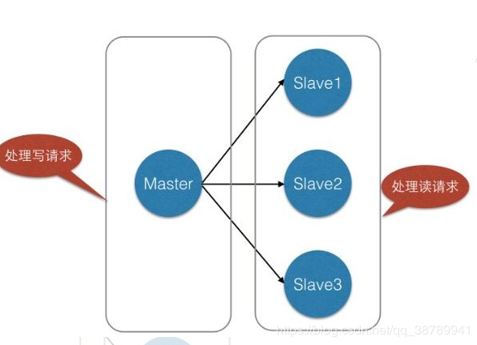
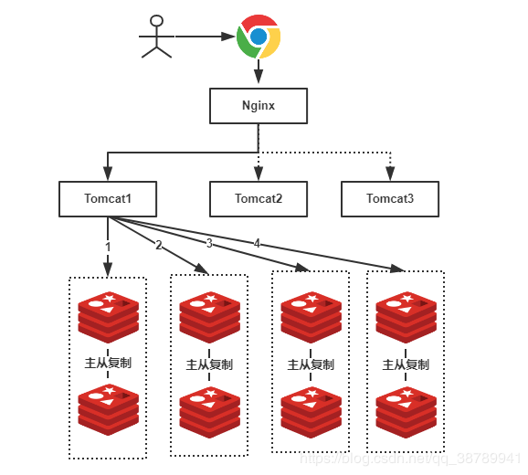
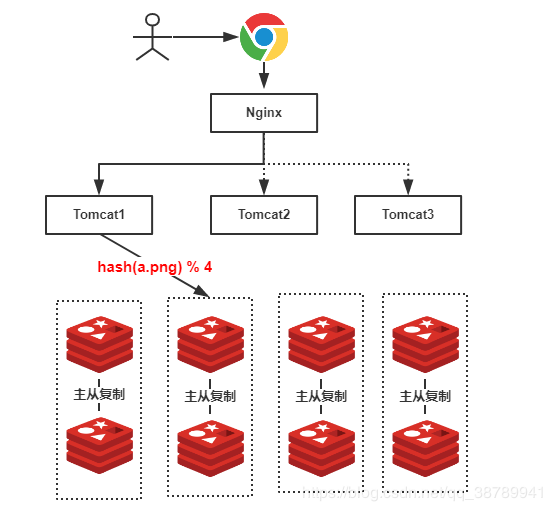

# 3、设计一个分布式负载均衡缓冲系统，如何快速定位到是那个服务器
<!-- @import "[TOC]" {cmd="toc" depthFrom=2 depthTo=6 orderedList=false} -->
<!-- code_chunk_output -->

* [key分段](#key分段)
* [一致性hash](#一致性hash)

<!-- /code_chunk_output -->
## key分段

我们在使用Redis的时候，为了保证Redis的高可用，提高Redis的读写性能，最简单的方式我们会做主从复制，组成Master-Master或者Master-Slave的形式，或者搭建Redis集群，进行数据的读写分离，类似于数据库的主从复制和读写分离。如下所示：

假设，我们有一个社交网站，需要使用Redis存储图片资源，存储的格式为键值对，key值为图片名称，value为该图片所在文件服务器的路径，我们需要根据文件名查找该文件所在文件服务器上的路径，数据量大概有2000W左右，按照我们约定的规则进行分库，规则就是随机分配，我们可以部署8台缓存服务器，每台服务器大概含有500W条数据，并且进行主从复制，示意图如下：

由于规则是随机的，所有我们的一条数据都有可能存储在任何一组Redis中，例如上图我们用户查找一张名称为”a.png”的图片，由于规则是随机的，我们不确定具体是在哪一个Redis服务器上的，因此我们需要进行1、2、3、4，4次查询才能够查询到（也就是遍历了所有的Redis服务器），这显然不是我们想要的结果，有了解过的小伙伴可能会想到，随机的规则不行，可以使用类似于数据库中的分库分表规则：按照Hash值、取模、按照类别、按照某一个字段值等等常见的规则就可以出来了！好，按照我们的主题，我们就使用Hash的方式。

如果我们使用Hash的方式，每一张图片在进行分库的时候都可以定位到特定的服务器，示意图如下：

**上图中，假设我们查找的是”a.png”，由于有4台服务器（排除从库），因此公式为hash(a.png) % 4 = 2 ，可知定位到了第2号服务器，这样的话就不会遍历所有的服务器，大大提升了性能！**

## 一致性hash
