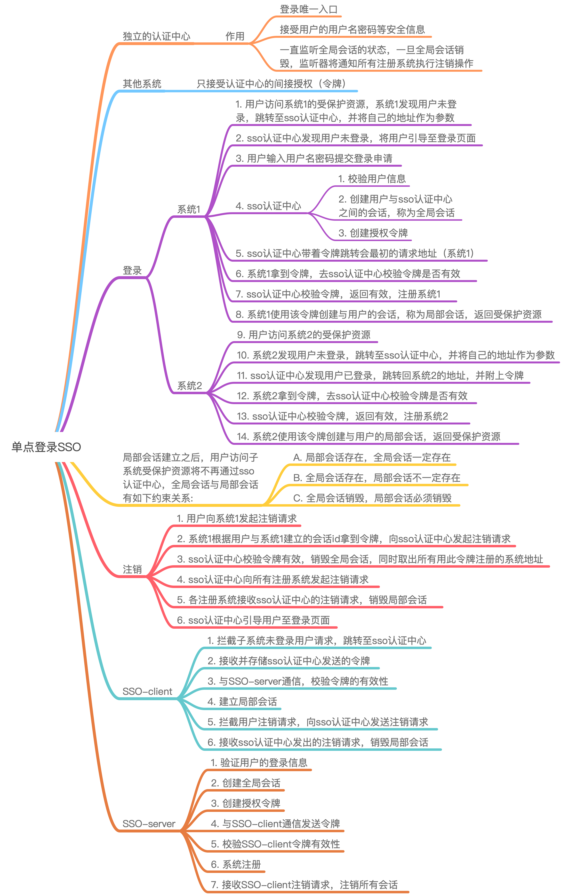

# 单点登录SSO

<!-- @import "[TOC]" {cmd="toc" depthFrom=2 depthTo=6 orderedList=false} -->
<!-- code_chunk_output -->

* [思维导图](#思维导图)
* [简介](#简介)
* [1. 登录](#1-登录)
* [2. 注销](#2-注销)
* [SSO-client](#sso-client)
* [SSO-server](#sso-server)

<!-- /code_chunk_output -->

## 思维导图

## 简介

单点登录全称Single Sign On（以下简称SSO），是指在多系统应用群中登录一个系统，便可在其他所有系统中得到授权而无需再次登录，包括单点登录与单点注销两部分。

## 1. 登录

相比于单系统登录，sso需要一个独立的**认证中心**，只有认证中心能接受用户的用户名密码等安全信息，其他系统不提供登录入口，只接受认证中心的间接授权。间接授权通过令牌实现，sso认证中心验证用户的用户名密码没问题，创建授权令牌，在接下来的跳转过程中，授权令牌作为参数发送给各个子系统，子系统拿到令牌，即得到了授权，可以借此创建局部会话，局部会话登录方式与单系统的登录方式相同。这个过程，也就是单点登录的原理，用下图说明

下面对上图简要描述

1. 用户访问系统1的受保护资源，系统1发现用户未登录，跳转至sso认证中心，并将自己的地址作为参数
2. sso认证中心发现用户未登录，将用户引导至登录页面
3. 用户输入用户名密码提交登录申请
4. sso认证中心校验用户信息，创建用户与sso认证中心之间的会话，称为全局会话，同时创建授权令牌
5. sso认证中心带着令牌跳转会最初的请求地址（系统1）
6. 系统1拿到令牌，去sso认证中心校验令牌是否有效
7. sso认证中心校验令牌，返回有效，注册系统1
8. 系统1使用该令牌创建与用户的会话，称为局部会话，返回受保护资源
9. 用户访问系统2的受保护资源
10. 系统2发现用户未登录，跳转至sso认证中心，并将自己的地址作为参数
11. sso认证中心发现用户已登录，跳转回系统2的地址，并附上令牌
12. 系统2拿到令牌，去sso认证中心校验令牌是否有效
13. sso认证中心校验令牌，返回有效，注册系统2
14. 系统2使用该令牌创建与用户的局部会话，返回受保护资源

用户登录成功之后，会与sso认证中心及各个子系统建立会话，用户与sso认证中心建立的会话称为全局会话，用户与各个子系统建立的会话称为局部会话，**局部会话建立之后，用户访问子系统受保护资源将不再通过sso认证中心**，全局会话与局部会话有如下约束关系。

- 局部会话存在，全局会话一定存在
- 全局会话存在，局部会话不一定存在
- 全局会话销毁，局部会话必须销毁

## 2. 注销

单点登录自然也要单点注销，在一个子系统中注销，所有子系统的会话都将被销毁，用下面的图来说明。

**sso认证中心一直监听全局会话的状态，一旦全局会话销毁，监听器将通知所有注册系统执行注销操作。**

1. 用户向系统1发起注销请求
2. 系统1根据用户与系统1建立的会话id拿到令牌，向sso认证中心发起注销请求
3. sso认证中心校验令牌有效，销毁全局会话，同时取出所有用此令牌注册的系统地址
4. sso认证中心向所有注册系统发起注销请求
5. 各注册系统接收sso认证中心的注销请求，销毁局部会话
6. sso认证中心引导用户至登录页面

## SSO-client

1. 拦截子系统未登录用户请求，跳转至sso认证中心
2. 接收并存储sso认证中心发送的令牌
3. 与SSO-server通信，校验令牌的有效性
4. 建立局部会话
5. 拦截用户注销请求，向sso认证中心发送注销请求
6. 接收sso认证中心发出的注销请求，销毁局部会话

## SSO-server

1. 验证用户的登录信息
2. 创建全局会话
3. 创建授权令牌
4. 与SSO-client通信发送令牌
5. 校验SSO-client令牌有效性
6. 系统注册
7. 接收SSO-client注销请求，注销所有会话
