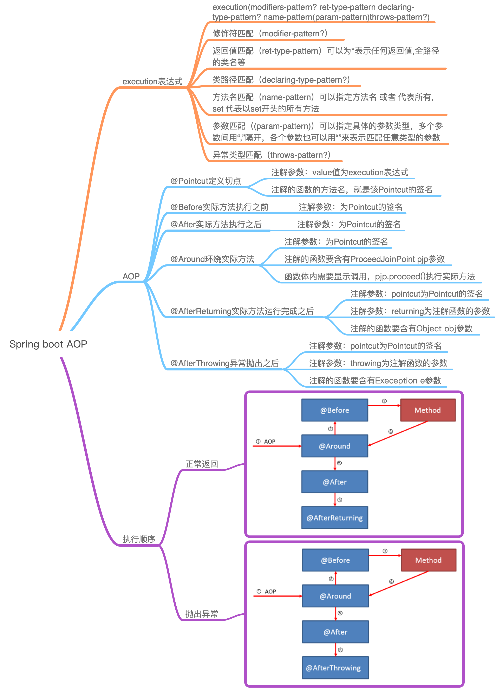
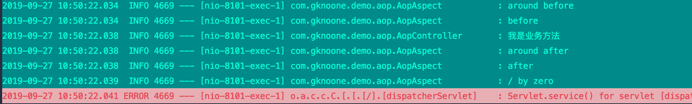

# Spring boot - AOP

<!-- @import "[TOC]" {cmd="toc" depthFrom=2 depthTo=6 orderedList=false} -->
<!-- code_chunk_output -->

* [思维导图](#思维导图)
* [Spring AOP(Java代理模式)](#spring-aopjava代理模式)
* [execution 表达式](#execution-表达式)
* [AOP](#aop)

<!-- /code_chunk_output -->

## 思维导图



## Spring AOP(Java代理模式)

具体可以看[代理模式](https://gknoone.github.io/java-interview/#/%E8%AE%BE%E8%AE%A1%E6%A8%A1%E5%BC%8F/%E4%BB%A3%E7%90%86%E6%A8%A1%E5%BC%8F)

## execution 表达式

```
execution(modifiers-pattern? ret-type-pattern declaring-type-pattern? name-pattern(param-pattern)throws-pattern?)
```

括号中各个pattern分别表示：

- 修饰符匹配（modifier-pattern?）
- 返回值匹配（ret-type-pattern）可以为*表示任何返回值,全路径的类名等
- 类路径匹配（declaring-type-pattern?）
- 方法名匹配（name-pattern）可以指定方法名 或者 *代表所有, set* 代表以set开头的所有方法
- 参数匹配（(param-pattern)）可以指定具体的参数类型，多个参数间用“,”隔开，各个参数也可以用“*”来表示匹配任意类型的参数，如(String)表示匹配一个String参数的方法；(*,String) 表示匹配有两个参数的方法，第一个参数可以是任意类型，而第二个参数是String类型；可以用(..)表示零个或多个任意参数
- 异常类型匹配（throws-pattern?）
- 其中后面跟着“?”的是可选项

示例

```
1）execution(* *(..))
//表示匹配所有方法
2）execution(public * com. savage.service.UserService.*(..))
//表示匹配com.savage.server.UserService中所有的公有方法
3）execution(* com.savage.server..*.*(..))
//表示匹配com.savage.server包及其子包下的所有方法
```

## AOP

- @Pointcut
  - 定义切点
    - 注解参数：value值为execution表达式
    - 注解的函数的方法名，就是该Pointcut的签名
- @Before
  - 实际方法执行之前
    - 注解参数：为Pointcut的签名
- @After
  - 实际方法执行之后
    - 注解参数：为Pointcut的签名
- @Around
  - 环绕实际方法
    - 注解参数：为Pointcut的签名
  - 注解的函数要含有`ProceedJoinPoint pjp`参数
  - 函数体内需要显示调用，`pjp.proceed()`执行实际方法
- @AfterReturning
  - 实际方法运行完成之后
    - 注解参数：`pointcut`为Pointcut的签名
    - 注解参数：`returning`为注解函数的参数
  - 注解的函数要含有`Object obj`参数
- @AfterThrowing
  - 抛出异常之后
    - 注解参数：`pointcut`为Pointcut的签名
    - 注解参数：`throwing`为注解函数的参数
  - 注解的函数要含有`Exeception e`参数

```java
@Aspect//声明AOP
@Component//声明组件
public class AopAspect {
    private static final Logger logger = LoggerFactory.getLogger(AopAspect.class);

    @Pointcut(value = "execution(public String test(..))")
    public void cutOffPoint() {
    }

    @Before("cutOffPoint()")
    public void before() {
        logger.info("before");
    }

    @After("cutOffPoint()")
    public void after() {
        logger.info("after");
    }

    @Around("cutOffPoint()")
    public Object around(ProceedingJoinPoint pjp) {
        logger.info("around before");
        Object obj = null;
        try {
            obj = pjp.proceed();
        } catch (Throwable throwable) {
            throwable.printStackTrace();
        }
        logger.info("around after");
        return obj;
    }
    @AfterReturning(returning = "result",pointcut = "cutOffPoint()")
    public void afterReturning(Object result){
      	//故意报错
        long l = 1/0;
        logger.info("after returning");
    }
    @AfterThrowing(throwing = "e",pointcut = "cutOffPoint()")
    public void throwError(Exception e){
        logger.info(e.getMessage());

    }
}
```

执行结果：

- 正常返回


- 抛出异常（其中`/by zero`是异常msg）



把异常代码放到test业务代码里面，如下

```bash
 com.gknoone.demo.aop.AopAspect           : around before
 com.gknoone.demo.aop.AopAspect           : before
 java.lang.ArithmeticException: / by zero
 ...
 ...
 com.gknoone.demo.aop.AopAspect           : around after
 com.gknoone.demo.aop.AopAspect           : after
 com.gknoone.demo.aop.AopAspect           : after returning
```


分析：

- 正常返回


- 抛出异常


AOP的AfterThrowing处理虽然可以对目标方法的异常进行处理，但**这种处理与直接使用catch捕捉不同，catch捕捉意味着完全处理该异常，如果catch块中没有重新抛出新的异常，则该方法可能正常结束**；而AfterThrowing处理虽然处理了该异常，但它不能完全处理异常，该异常依然会传播到上一级调用者，即JVM。
