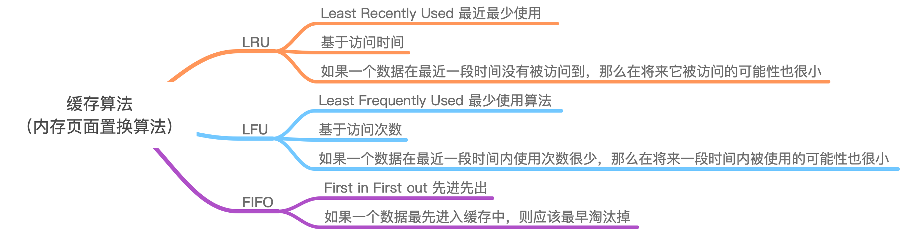

# 缓存算法（内存页面置换算法）LRU、LFU、FIFO
<!-- @import "[TOC]" {cmd="toc" depthFrom=2 depthTo=6 orderedList=false} -->
<!-- code_chunk_output -->

* [思维导图](#思维导图)
* [核心](#核心)
* [1. LRU算法](#1-lru算法)
	* [LRU Cache具备的操作：](#lru-cache具备的操作)
* [2. FIFO算法](#2-fifo算法)
	* [FIFO Cache中应该支持以下操作;](#fifo-cache中应该支持以下操作)
* [3. LFU算法](#3-lfu算法)
	* [LFU Cache应该支持的操作为：](#lfu-cache应该支持的操作为)

<!-- /code_chunk_output -->
## 思维导图

## 核心

Cache算法和内存页面置换算法的核心思想是一样的：**都是在给定一个限定大小的空间的前提下，设计一个原则如何来更新和访问其中的元素。**

## 1. LRU算法

LRU（Least Recently Used）最近最少使用，核心原则：**如果一个数据在最近一段时间没有被访问到，那么在将来它被访问的可能性也很小**。也就是说，当限定的空间已存满数据时，应当把最久没有被访问到的数据淘汰。

### LRU Cache具备的操作：

- set(key,value)：如果key在hashmap中存在，则先重置对应的value值，然后获取对应的节点cur，将cur节点从链表删除，并移动到链表的头部；若果key在hashmap不存在，则新建一个节点，并将节点放到链表的头部。当Cache存满的时候，将链表最后一个节点删除即可。

- get(key)：如果key在hashmap中存在，则把对应的节点放到链表头部，并返回对应的value值；如果不存在，则返回-1。

> 可以用双向链表实现，如果节点被插入访问，就把它移动到链表头部，内存不足删除尾部节点

## 2. FIFO算法

FIFO（First in First out），先进先出。

在FIFO Cache设计中，核心原则就是：**如果一个数据最先进入缓存中，则应该最早淘汰掉。**也就是说，当缓存满的时候，应当把最先进入缓存的数据给淘汰掉。

### FIFO Cache中应该支持以下操作;

- get(key)：如果Cache中存在该key，则返回对应的value值，否则，返回-1；

- set(key,value)：如果Cache中存在该key，则重置value值；如果不存在该key，则将该key插入到到Cache中，若Cache已满，则淘汰最早进入Cache的数据。

> 利用一个双向链表保存数据，当来了新的数据之后便添加到链表末尾，如果Cache存满数据，则把链表头部数据删除，然后把新的数据添加到链表末尾。在访问数据的时候，如果在Cache中存在该数据的话，则返回对应的value值；否则返回-1。如果想提高访问效率，可以利用hashmap来保存每个key在链表中对应的位置。

## 3. LFU算法

LFU（Least Frequently Used）最少使用算法。它是基于“**如果一个数据在最近一段时间内使用次数很少，那么在将来一段时间内被使用的可能性也很小**”的思路。

**LRU的淘汰规则是基于访问时间，而LFU是基于访问次数的**

### LFU Cache应该支持的操作为：

- get(key)：如果Cache中存在该key，则返回对应的value值，否则，返回-1；

- set(key,value)：如果Cache中存在该key，则重置value值；如果不存在该key，则将该key插入到到Cache中，若Cache已满，则淘汰最少访问的数据。

>  利用一个数组存储 数据项，用hashmap存储每个数据项在数组中对应的位置，然后为每个数据项设计一个访问频次，当数据项被命中时，访问频次自增，在淘汰的时候淘汰访问频次最少的数据。
